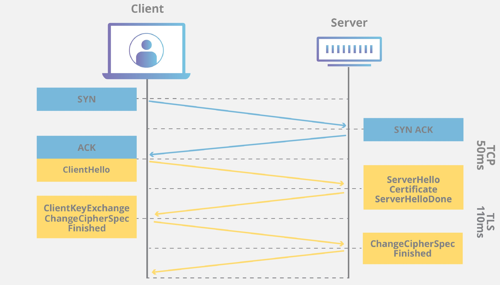

## Client Server Communication
>_Making a server and a client communicate with each other isn't that hard,_ **_but doing it correctly, efficiently, and securely is a much more complex task_**

#### Netcat
- **_Netcat_** is a simple Unix utility which reads and writes data across network connections, using TCP or UDP protocol.
- It is known as the Swiss Army knife of networking tools
```
nc host port : to connect your terminal to the server

nc google.com 80
HEAD / HTTP/1.1 (press Enter twice)
```
#### HTTP Verbs
- _GET_
- _POST_
- _HEAD_: the client verifies the last time a particular resource was updated
- _OPTIONS_: the client wants to know which verbs the server supports
##### Response Headers 
- _Content-Length_ : non-optional
- _Content-Type_: non-optional
- _Last-Modified_: some cases, a document can been changed but its content doesn't change. For example, developers upload all files to the server after fixing something. So, should consider _Etag_ (entity tag) which is an unique identifier to verify that the content of document changed or not.
- _Cache-Control_: allow the server to control how and for how long the client will cache the response received
- _If-Modified-Since_: allow the server to skip sending the actual content of the document if it hasn't been changed since the date provided in that header.
- Refer to [HTTP headers](https://developer.mozilla.org/en-US/docs/Web/HTTP/Headers).

#### Performance
- Time to first bye (TTFB) ?
- Head-of-line blocking is when one request is blocking others from completing. Imagine it's like a waiting queue for serving coffee.
- TCP handshake takes time --> HTTP 1.1 introduced the concept of _keep-alive_. - **Note** that the number of HTTP connections from the same domain name is restricted by browsers. Normally, the limitation is **6 connections**. 
So, small js and css files are commonly bundled together to use connections more effectively.
##### Try a calculation:
- 6 connections per a domain name, 
- assume that each round-trip takes about 35 ms. 
- and, if a web page has 60 requests to load the page completely.
--> ~ 60/6 * 35 (ms) is total transfer time

##### HTTP/1 Problems:
- Head-of-blocking
- Uncompressed Headers, just compressed data (the body)
- The content of headers repeat a lot, such as: Host header, cookies, and others.
- Security ???

##### HTTP/2 Solutions:
- Multiplexing --> Head-of-blocking is gone
  - One connection for all requests instead of 6 connections of HTTP /1
  - A request is as a stream
- HTTP /2 compression (HPACK)
  - All streams not only share the connection, but also the compressor
    - the header never has to be sent twice since the compressor recognizes that it's been sent before, so it sends a reference instead.
##### Working with HTTP/2:
- Not need to bundle small js and css files into one. Sometimes, the method of bundling can lead to negative effects. For example, when a developer only modifies a small part of a js file, but the cache must get the whole bundle instead of an adjusted small fragment.
- All servers that speak HTTP/2 will be able to speak HTTP/1.

So, while developing for HTTP/2:
- **To DO:**
  - Minify Javascript/css/markup
  - Use a CDN
- **NOT to DO:**
  - Concatenate Javascript/css
  - Sprite images
  - Shard your assets
#### Security 
##### The same origin policy [More detail](https://www.w3.org/Security/wiki/Same_Origin_Policy)
- An origin is comprised of 3 parts: **the schema, host, and port** of a URL
- Generally speaking, documents retrieved from distinct origins are **isolated** from each other.
- One origin is permitted to send information to another origin
- But, one origin is not permitted to receive information from another origin
##### Overriding The Same Origin Policy
###### JSONP - JSON with Padding
- This is the solution in the past. **Not recommend** for its limitations and security risks.
##### CORS - Cross Origin Resource Sharing
- This is the more secure and flexible solution
- It allows the server side to specify which domain names are allowed to access which resources, and what types of requests are allowed too.
- [Refer to Cors-in-Express/Nodejs](/Cors-in-Express.md)
- [More details on MDN](https://developer.mozilla.org/en-US/docs/Web/HTTP/CORS)
###### Preflight requests?
- A preflight request is a CORS mechanism that is used to check whether the actual request is safe to send.
- It is an HTTP **OPTIONS** request that is sent by the **browser** to the server before sending the actual request.
- The preflight request includes **headers** that describe the actual request that will be sent, such as the HTTP **method**, **content type**, and **custom headers**.
- **The server** then responds to the preflight request with headers that indicate whether the actual request is allowed, and what restrictions apply.
- The browser will or will not send the actual request depending on the response of the above preflight request.
- **Note:** 
  - Not all requests that require the browser to send a preflight request. 
  - Preflight requests are used for requests:
    - use HTTP methods **other than _GET_, _POST_, _HEAD_**
    - or includes **custom headers**

#### HTTPS
- HTTPS = HTTP + TLS (formerly known a SSL)
##### TLS - Transport Layer Security
- TLS (Transport Layer Security) can be used by any protocol, not just HTTP. 
- For example, FTPS = FTP (File Transfer Protocol) + TLS.
- TLS encrypts communication in a way that can't be read by anyone else other than the intended recipients.
###### TLS provides some important **guarantees** for web security:
- It keeps the connection **private** by encrypting everything sent over it. Only the server and the browser should be able to read what's being sent.
- It lets the browser **authenticate** the server. For instance, when a user accesses https://www.udacity.com/, they can be sure that the response they're seeing is really from Udacity's servers adn not from an impostor.
- It helps protect the **integrity** of the data sent over that connection - checking that it has not been (accidentally or deliberately) modified or replaced.
###### How does TLS assure **privacy**?
- The data in the TLS certificate like public key and the server's private key are mathematically related to each other through a system called **public-key cryptography**. [Read more here](https://en.wikipedia.org/wiki/Public-key_cryptography). 
- The important part is that the two endpoints (the browser and server) can securely agree on a **shared secret** which allows them to scramble the data sent between them so that only the other endpoint - and not any eavesdropper - can unscramble it.
###### How does TLS assure **authentication**?
- Thanks to the server certificate, the browser can verify that it is 'speaking' to the correct server. 
- Refer to the **step 3** and **step 4** of the progress of the TLS handshake below.
###### How does TLS assure integrity?
- Every request and response sent over a TLS connection is sent with a [message authentication code (MAC)](https://en.wikipedia.org/wiki/Message_authentication_code) that the other end of the connection can verify to make sure that the message hasn't been altered or damaged in transit.
##### Encryption and Hashing
- **Encryption:** 
  - **Asymmetric encryption:** with 2 keys, one key as public key is used for encryption by anyone who wants to send a message with you, the other key as private key is used to decrypt the message. **_Note_:** both 2 keys can encrypt a data and the other will decrypt the encrypted data.
  - **Symmetric encryption:** with 1 key that is used to encrypt and decrypt.
- **Hashing:** 
  - The process of transforming data into a short representation of the original data,
  - and be impossible to revert the original data from the hashed representation.

##### How does the client know that the document received is from the server?
##### Digital Signature! Using an asymmetric encryption
**Option 1:**
- Server:
  - encrypt the document with its private key
  - then send **the encrypted document**
- Client:
  - decrypts the encrypted document with the public key to verity

**Option 2:**
- Server:
  - hash the document, 
  - then encrypt the hash with its private key
  - then send the document and **the encrypted hash**
- Client:
  - decrypt the encrypted hash with the public key, 
  - then hash the document 
  - then compare the decrypted hash with the hash, which is hashed by the client, to verify

**Remember that** the time of encrypting a document is much longer than the time of hashing a document.
##### The TLS Handshake
- TLS handshake occurs after a TCP connection has been opened via a TCP handshake

- The purpose of the TLS handshake is to establish a secure connection. During the handshake, the client and server do the following:
  - Specify which version of TLS they will do. 
  - Decide on which cipher suites they will do.
  - Authenticate the identity of the server via the server's public key and the SSL certificate authority's digital signature
  - Generate session keys in order to use symmetric encryption after the handshake is complete.
- The detail of the TLS handshake [on cloudflare](https://www.cloudflare.com/learning/ssl/what-happens-in-a-tls-handshake/)
- Commonly, the steps as following:
  1. The client sends a 'hello' message to the server, which includes **the versions** of TLS it supports, a **client random number**, and a list of **supported encryption algorithms**
  2. The server responds with a 'hello' message of its own, which includes the **version** of TLS it will use, a server random number, and **the encryption algorithm** it has chosen from the client's list.
  3. The server sends its digital certificate to the client, which includes the **server's public key** and other identifying information such as: the **domain** the certificate is for and the **signature** by a certificate authority.
  4. The client verifies the certificate and uses the server's public key to **encrypt a new random number**, which will be used as the session key for the secure connection.
  5. The client sends the encrypted session key to the server.
  6. The server decrypts the session key using its private key.
  7. Both the client and server use **the session key** to encrypt and decrypt data transmitted during the secure connection. **Note:** data is encrypted and decrypted with **symmetric encryption** with the session key.
   
#### Security Exploit
##### CSRF - Cross-site request forgery
- Use CSRF token to protect users against this type of attack.
- Include a CSRF token into a hidden field of a form that requires the protection against CSRF attacks
- Server checks the CSRF token before processing the request submitted from users.
###### Where is the data of user's sessions and cookies stored?
- The data of **session** is stored in the **server side**.
- The data of **cookie** is stored in the **client side**.

##### XSS - Cross-site scripting
- User input is everything --> user can inject Javascript code into an input field --> The javascript code can get other users' data like cookies or the dom.
- This type of security exploit is called Cross-site scripting (XSS)
- Always validate user input to protect against this type of attack.
- [Read detail here](https://en.wikipedia.org/wiki/Cross-site_scripting)
- Exploits of a Mom [xkcd_327](https://www.explainxkcd.com/wiki/index.php/327:_Exploits_of_a_Mom)