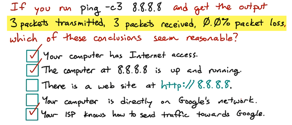
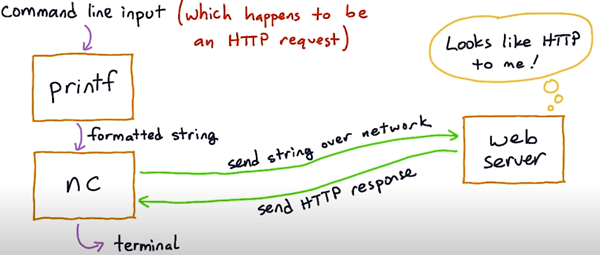
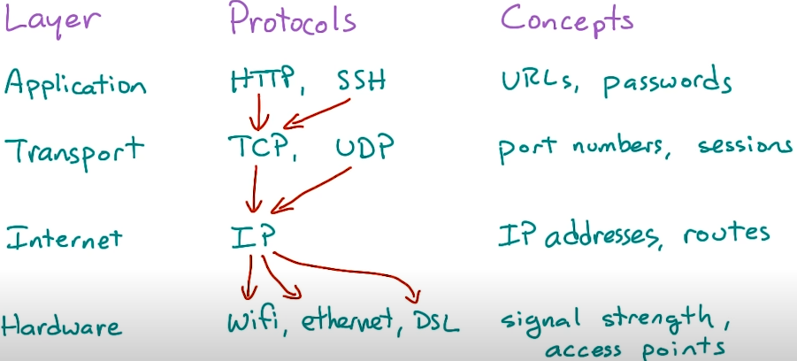
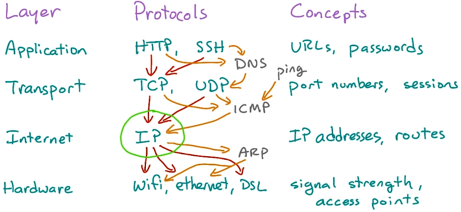

##[Networking for Web Developers - Udacity](https://www.udacity.com/course/networking-for-web-developers--ud256) - Part 1

#### Networking Tools
Update packages:
```
sudo apt-get update && sudo apt-get upgrade
```
Install several network utility programs:
```
sudo apt-get install netcat-openbsd tcpdump traceroute mtr
```

### From Ping to HTTP
```
ping -c3 8.8.8.8
```
- _ping_ is a command **for testing** whether your computer can send and receive network traffic with that address

#### Ping vs HTTP
- With _ping_, the message it sends, called an _Echo request_, is received by the destination system's **operating system**. It means that there's no _ping_ server, the Echo request just goes to the operating system on the receiving end, which sends a response back.
- With an application protocol such as HTTP or SSH, there's a server program that composes a response and sends it back the client.
- **Note:** 
  - Every operating system that supports Internet access supports _ping_ as well.
  - _Ping_ is simpler than HTTP, but HTTP is not based on on _ping_.

#### printf and netcat
```
 printf 'HEAD / HTTP/1.1\r\nHost: en.wikipedia.org\r\n\r\n' | nc en.wikipedia.org 80
```
#### printf and netcat illustrate layers
##### Why is it a big deal that we can get HTTP response with Netcat and printf?
1. _printf_ doesn't know anything about the network
2. _netcat_ doesn't know anything about forming HTTP requests. _Netcat_ can only do is connecting to a port and sending a string over it.
3. To the web server, that string happens to look like an HTTP request and so, the server responds.

So, what we've done here is to separate out 2 different layers of activity:
1. the text of the http request
```
 printf 'HEAD / HTTP/1.1\r\nHost: en.wikipedia.org\r\n\r\n'
```
2. and, the connect to a port transmit some data and get some results part
```
nc en.wikipedia.org 80
```




#### Different layers of network protocols
- The http layer is implemented by **programs** such as web browsers and servers
- The lower layer, TCP is implemented in the **operating system**
- **Note:** _Netcat_ is a lower level tool than something like _curl_. The _nc_ command is a thing wrapper over TCP.

- The concepts of the application layer: URLs, passwords, the head command, server headers, web pages. Things that make sense to specific applications such as web browsers or SSH clients.
- Application protocols are based on protocols with a transport layer, like TCP and UDP.
- Transport protocols are based on the internet layer, the one single protocol IP
- IP protocol runs on top of different kinds of hardware, like wifi or ethernet or DSL lines.
- Each of these layers depends on the one below it and provides particular guarantees to the layers above it. We can think of them as offering and using apis, separating out specific concerns and making it possible to **reuse** features.

See, everything above or below goes through IP.

#### What really is a server? 
- It's a program that handles requests from clients. 
- But ... **How?**

Open 2 terminal windows, and use _nc_ to create a connection between them and talk together.
One side: listen on port 1234
```
nc -l 1234
```
Other side: connect to that port
```
nc localhost 1234
```

The connection is done and 2 sides can talk to each other. This is there is nothing to do with HTTP or a web server, anyway. It's the one layer below that, it's something like a **plain TCP server**.
- A **TCP session** is like a two-way road. It means that it's possible for both ends of a TCP session to be sending **at the same time**.

#### Port Numbers
- Port numbers distinguish different applications on the same host.
- The highest port that you can listen on: **65536**
- The lowest port that you can listen on: **1024**
- You can listen on ports below 1024 (down to 1) with the permission root.
- **Note:** For security, a web server gets rid of its root privileges once it starts up. This reduces risks if the web server has vulnerability and is exploited by an attacker. In this case, the attacker doesn't have the full permission to control the system.

The **_lsof_** utility **lists open files** (l_s_o_f), including network sockets (listening or connected)
```
sudo lsof -i //-i: list only network sockets 
```

### Names and Addresses
_ping_ to a hostname
```
ping -c 3 google.com
```
- _ping_ command has to look up the IP address of the host first
#### DNS - Domain Name System
- DNS is a worldwide distributed directory of network information.
- It stores a wide variety of **records** but the best known kind of DNS record is teh A-Record. _A_ stands for _Address_, which maps a name like www.example.com to an IPv4 address.
- Client programs such as web browsers look up these records in order to find the address of a website or another service.
##### The Resolver - The DNS Client Code
- It is built into every operating system
- Programs such as _nc_, _ping_, _web browsers_ can just use it.
##### Setup DNS records for your website
- What is it for? For your users can access your website by domain.
- Register the domain with a registrar
- Then point the DNS records at the web servers IP addresses

##### The _host_ command
- _host_ is a basic utility for looking up records in DNS
- It will query your OS service _named_. Which usually ends up sending a request to whatever DNS server your computer's configured to use.
```
host google.com
```
```
host -t a google.com
```
##### _dig_ into DNS records
```
dig www.udacity.com
```
##### DNS records types
- _CNAME_: canonical name
- _AAAA_ ('quad-A'): IPv6 address
- _NS_: DNS name server
#### DNS and HTTP
- Domain names are also **essential** to several HTTP features, including **cookie security** and **SSL/TLS**.
- A single web server can handle requests from multiple sites which it tells apart by their domain names. _Apache_ calls this a _virtual host configuration_, _NginX_ calls this having _multiple server blocks_.
- That is the reason why HTTP requests require a _host_ header.
- When a web app sets a cookie, it sets that cookie for a particular domain names, and further requests to that domain will get that cookie sent back.
- And SSL/TLS encryption certificate are issued for particular domains.
