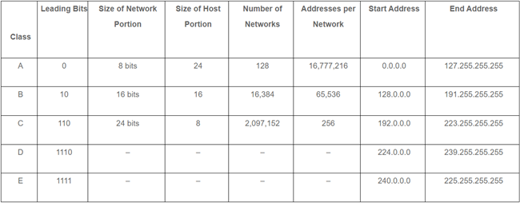
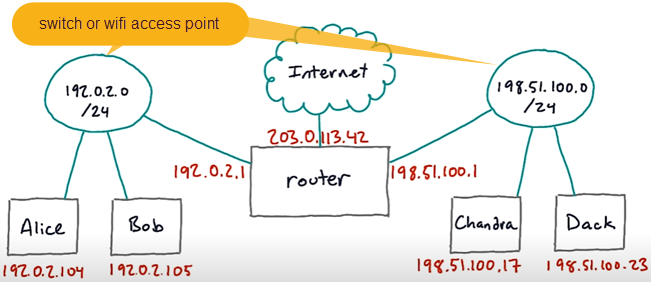
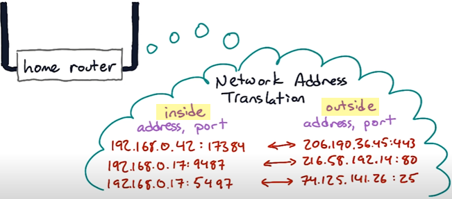

##[Networking for Web Developers - Udacity](https://www.udacity.com/course/networking-for-web-developers--ud256) - Part 2
[Part 1](/Networking-for-Web-Developer-Part1.md)
### Addressing and Networks
#### Special Addresses
**IPv4**
- 32-bit or 4 octet
- Not all of the possible 32 bit values are used for real addresses.
- Some are reserved for special protocols.
- Some are reserved for internal private networks.
- Some are for testing or documentation.

**5 classes**
- Classes A, B, and C are used for addressing devices
- Class D is for multicast groups
- Class E is reserved for experimental use


**Private address ranges**
- 10.0.0.0 to 10.255.255.255
- 127.16.0.0 to 127.31.255.255
- 192.168.0.0 to 192.168.255.255
  
#### Netblocks and Subnets
- A netblock is a block of ip addresses
##### How many ip addresses in a network?
- Computers on the same network block can communicate with each other without going through a router.
- An ip address is composed of 2 parts: network section and host section.
- Each machine in a LAN will have the same network address and subnet mask, but the host section of the ip address will be different.
- E.g: _/24 network with the network prefix 198.51.100_ = 10 bits for  host part = 2^10 addresses. But:
  - 1 address is reserved for the network address. All bits of host part is _0_. _(198.51.100.0)_
  - 1 address is reserved for the broadcast address. All bits of host part is _1_. _(198.51.100.255)_
  - Usually, 1 address is reserved for the router address (default gateway). It's usually the first address in the address range in which addresses can assigned to hosts on the network. _(198.51.100.1)_
  - So, the number of remaining addresses can be assigned to hosts: **1024 - 3 = 1021**.
##### Subnet masks
- We can use a subnet mask to write a network size. 
- _/24 network_ can be written with a subnet mask _255.255.255.0_. 
- A subnet mask is formed by all bits of the network section set 1, all bits of the host section set 0.
- This is often used in network configuration. Thanks to the subnet mask, an ip address can be separated 2 parts: network and host.
##### Subnets
- An organization can split their assigned net block into **subnets** to make management easier and control traffic.
- **The subnets** are created by borrowing bits from the host section and using them as **subnet bits**.
##### Network Interfaces

- Virtual machine interface connects the host operating system and the guest operating system
- **Loopback interface** is a special interface that almost always has the IP address _127.0.0.1_ and the host name _localhost_, and allows programs to use _the network stack_ to talk to other programs on the same host.
  
**Remind:** _the network stack_ is aka _the protocol stack_ or _the internet protocol suite_. The network stack is divided into layers, each of which performs a specific function. They layers work together to enable applications to communicate over a network.
##### Routers and Default Gateways
- A router is a device that connects two different IP networks. It acts as a gateway.
- So, hosts on one network that want to send traffic to the other one, forward the traffic to the router.
- The host on a local network knows about a **default gateway**.
- Computers  that are attached to the same switch or Wifi access point or other network hardware are normally **local** to each other. These computers **directly send** packets to one another without going through a different network, or without through the gateway.

```
ip route show default (Linux only)
```
```
netstat -nr (Linux, Mac, Unix)
```
##### NAT

- Private IP addresses are used with a system called **NAT** or _Network Address Translation_
- Whenever traffic goes between the private network behind the router and the public internet, the router has to re-write or translate to the network addresses on it.
- The router maintains a map of which inside addresses and ports **are connected to** what pubic internet addresses and ports.

##### Private and Public
- Private addresses can't be used to directly on the public network since they are not actually unique.
- Remind, 3 different blocks of IP addresses (netblock) are reserved for private use.
  - 10.0.0.0/8
  - 172.16.0.0/12
  - 192.168.0.0/16
- Web servers and other internet services outside don't see your private address. They only see the public address, which is the other side of your router.