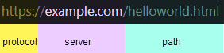
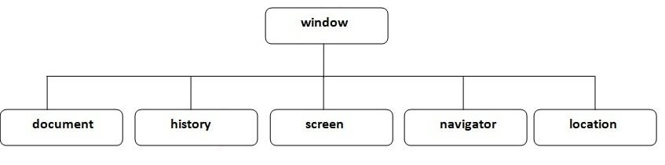

### 1. DOM - Document Object Model
##### To dive deeply into DOM read [this thread on MDN](https://developer.mozilla.org/en-US/docs/Web/API/Document_Object_Model)

#### DOM is a programming interface for web documents. Why?
- Model
- Object Model
- Object **Model** of Document
- DOM as a **data structure** of web documents (HTML, XML, SVG, ...)
- A web document is comprised of elements such as &lt;html&gt; &lt;body&gt;, &lt;div&gt;, &lt;p&gt;, etc.
- These elements are represented in the DOM as **objects** that have properties and methods
- We can use programming languages like Javascript to manipulate these objects via their properties and methods to change the content, style, or behavior of the elements on the web document 
 
- So, in terms of object-oriented programming, DOM is as a set of APIs to control the elements of web documents.
### 2. HTTP - Hypertext Transfer Protocol 
To dive deeply into **HTTP** read [this thread on MDN](https://developer.mozilla.org/en-US/docs/Web/HTTP/Basics_of_HTTP)
- A computer can use the Internet to **shoot bits at** another computer
- How does the receiving side know what these bits represents? So, this is the reason why we need network protocols **to describe a style of communication** over a network such as for sending email, for sharing files, etc.
- And, HTTP is a protocol for fetching/retrieving **named resources** on **the Web**.
- Each resource on the Web is named by a URL (_Uniform Resource Locator_), which looks something like this:

- HTTP is simple, extensible and **stateless**

### 3. What are the purposes of web browsers?
To dive deeply into **web browsers** read the articles: [How browsers work](https://web.dev/howbrowserswork/) and  [Populating the page: how browsers work](https://developer.mozilla.org/en-US/docs/Web/Performance/How_browsers_work)

#### A web browser has two main functions:
1. Request a resource from servers
2. Display the content of the received resource in the browser window
   - See, the DOM-tree construction is a part of this.  

### 4. BOM - Browser Object Model
BOM allows Javascript to 'talk to' the browser. Refer to [this](https://www.javatpoint.com/browser-object-model) for more detail
- BOM is a set of objects and methods provided by the browser that allow JavaScript to interact with the browser and the web page.
- **Note:** BOM is not a part of official Javascript specification. Each browser can implement BOM differently. So, code that replies on BOM may not be portable across different browsers. 
- The default object of browsers is **_window_**. 
- There are properties/other objects as a part of window, there are underneath the window object like _document_, _screen_, _history_, _navigator_, _location_, _innerHeight_, _innerWidth_.

#### The **_window_** object
- It represents the browser's window.
- **All global** Javascript _objects_, _functions_, _variables_ **automatically** become members of the _window_ object.
- [Detail on MDN](https://developer.mozilla.org/en-US/docs/Web/API/Window)

### 5. HTML Specification vs DOM Specification?
- The HTML specification defines **the structure and content of web pages**. It specifies the elements, attributes, and other features that can be used to create web pages.
- The DOM specification, on the other hand, defines **how** web browsers should **represent HTML documents as a tree-like structure** called the DOM. The DOM is a programming interface for web developers to manipulate the content and structure of web pages using JavaScript.
- So, the HTML specification defines the **content and structure of web pages**, while the DOM specification defines how web browsers should represent that content and structure in a way that can **be manipulated with JavaScript**.

### 6. Web APIs
- In Web development, an API is generally a set of code features (e.g. methods, properties, events)
- And, a **developer** can use them in their apps for interacting with components of a **user's web browser**, or other software/hardware **on the user's computer**, or **third party** websites and services.