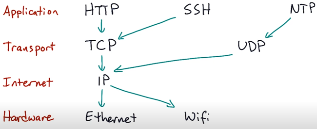
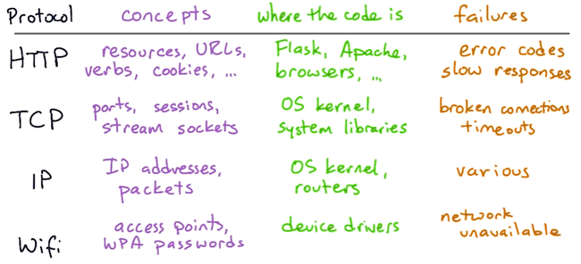

## [Networking for Web Developers - Udacity](https://www.udacity.com/course/networking-for-web-developers--ud256) - Part 3

[Part 1](/Networking-for-Web-Developer-Part1.md), [Part 2](/Networking-for-Web-Developer-Part2.md) Part 3
### Protocol Layers
- A protocol stack or a stack of networking protocols that supports all sorts of different internet applications.
- See, **HTTP** on **TCP** on **IP** on **Hardware**. 
  
Questions:
  - How these layers work together? 
  - How each layer depends on behavior or guarantees made by the **layer below**?
  - And, how it hides the details of the lower layer, giving programmers a simpler interface?

#### Protocol Stack


#### Watching Ping and DNS in _tcpdump_
Try the cmd below to catch traffic going between your host and the host at 8.8.8.8
```
sudo tcpdump -n host 8.8.8.8
```
Then open another terminal and try
```
ping -c3 8.8.8.8
```
Use _tcpdump_ to monitor traffic for any network application. For example, if you want to see all the DNS requests your machine sends, you need to know **what port** DNS uses. It's **53**.
```
sudo tcpdump -n port 53
```
Then open another terminal and try
```
ping google.com
```
#### Watching HTTP in _tcpdump_
Try _tcpdump_ to look at the packets that your machine uses to talk to a web server.
```
sudo tcpdump -n port 80
```
Another terminal
```
 printf 'HEAD / HTTP/1.1\r\nHost: example.net\r\n\r\n' | nc example.net 80
```
Look the output. These are the packets. What we see is the data of **the headers** of these packets or the **metadata**.
- _length_ That's just the length of the payload, the **actual HTTP data**.
```
10:46:38.484301 IP 192.168.1.27.40864 > 93.184.216.34.80: Flags [S], seq 1130928562, win 64240, options [mss 1460,sackOK,TS val 1360158868 ecr 0,nop,wscale 7], length 0
10:46:38.675225 IP 93.184.216.34.80 > 192.168.1.27.40864: Flags [S.], seq 3799176987, ack 1130928563, win 65535, options [mss 1460,sackOK,TS val 3656323872 ecr 1360158868,nop,wscale 9], length 0
10:46:38.675435 IP 192.168.1.27.40864 > 93.184.216.34.80: Flags [.], ack 1, win 502, options [nop,nop,TS val 1360159059 ecr 3656323872], length 0
10:46:38.675746 IP 192.168.1.27.40864 > 93.184.216.34.80: Flags [P.], seq 1:39, ack 1, win 502, options [nop,nop,TS val 1360159060 ecr 3656323872], length 38: HTTP: HEAD / HTTP/1.1
10:46:38.866460 IP 93.184.216.34.80 > 192.168.1.27.40864: Flags [.], ack 39, win 128, options [nop,nop,TS val 3656324064 ecr 1360159060], length 0
10:46:38.867087 IP 93.184.216.34.80 > 192.168.1.27.40864: Flags [P.], seq 1:329, ack 39, win 128, options [nop,nop,TS val 3656324064 ecr 1360159060], length 328: HTTP: HTTP/1.1 200 OK
10:46:38.867191 IP 192.168.1.27.40864 > 93.184.216.34.80: Flags [.], ack 329, win 501, options [nop,nop,TS val 1360159251 ecr 3656324064], length 0
^C
7 packets captured
7 packets received by filter
0 packets dropped by kernel
```