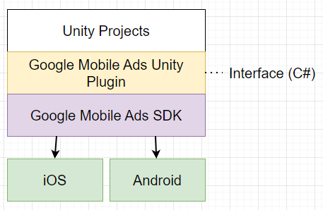

# Google Mobild ads Unity Plugin

1. **Unity Projects**: You develop your game or app in Unity, using the C# interface provided by the Google Mobile Ads Unity Plugin.
2. **Google Mobile Ads Unity Plugin**: This plugin translates the high-level C# commands from your Unity project into calls to the Google Mobile Ads SDK.
3. **Google Mobile Ads SDK**: The SDK handles the actual ad operations, such as loading, displaying, and tracking ads.
4. **iOS and Android**: The SDK ensures that these operations are executed correctly on both iOS and Android platforms.

This layered approach allows Unity developers to integrate Google Mobile Ads seamlessly without needing to handle platform-specific details directly, streamlining the development process and ensuring compatibility across multiple platforms.