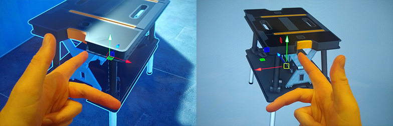

# Coordinate System in Unity

### Overview
- Left-handed Y-Up
    - X (red): left to right
    - Y (green): down to up
    - Z (blue): front to back

Left-handed Y-Up VS Right-handed Y-Up

- World (or Universal) space vs Local (or Relative) space?
- GUI space?
- Screen space?
- Camera? Camera view?
- Viewport space?
- Canvas?
- Transform?
- Is there a relationship between World space with Camera view?
- Main Camera vs other Cameras?
