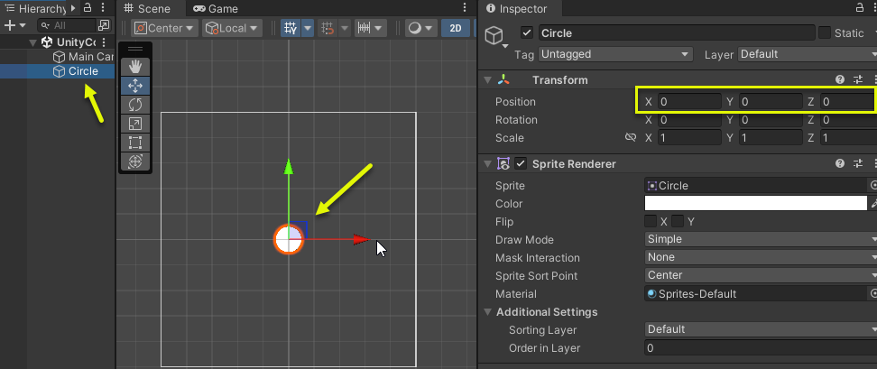
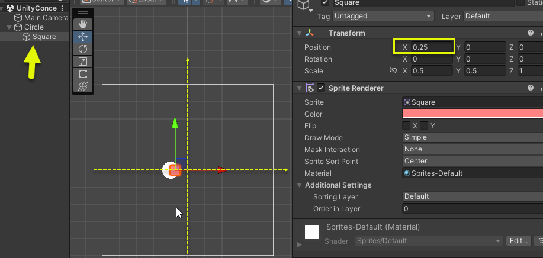
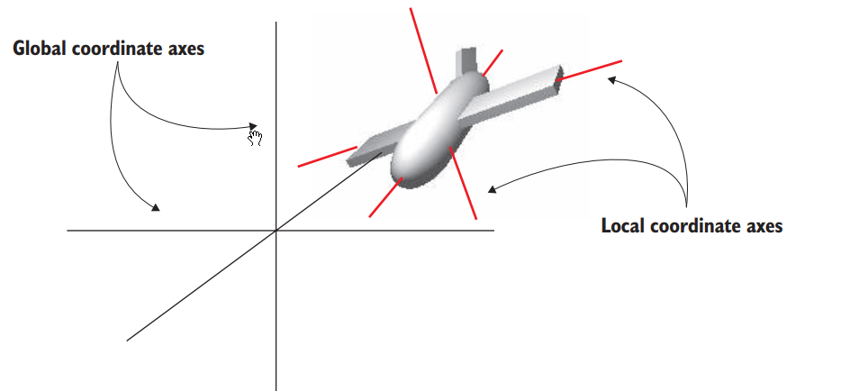
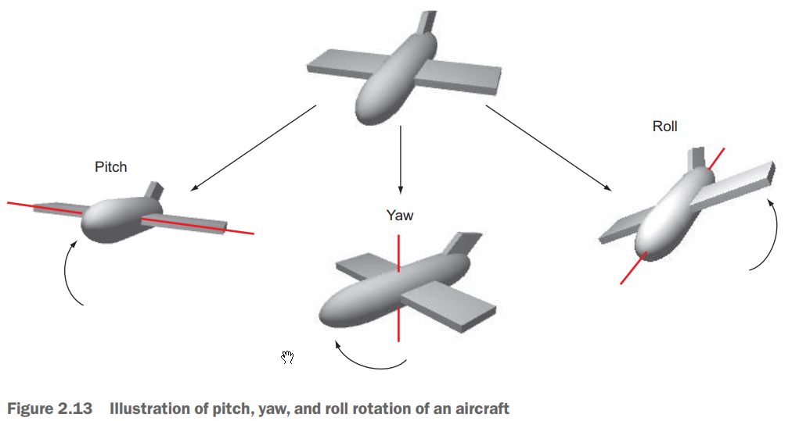
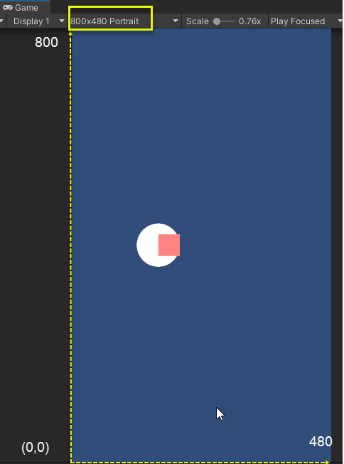
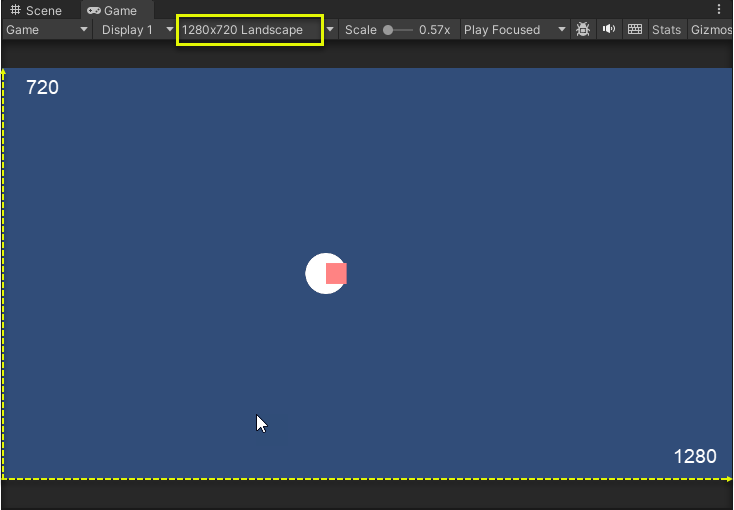
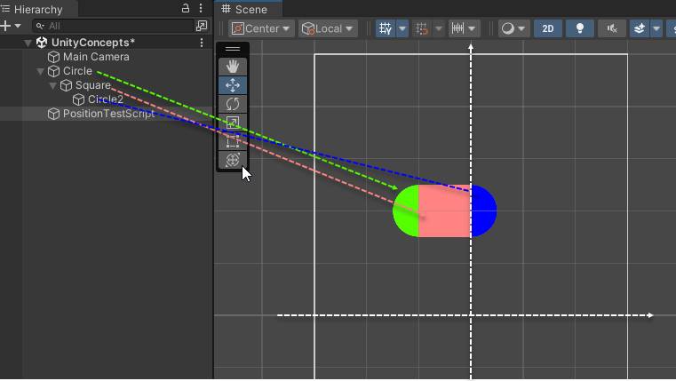
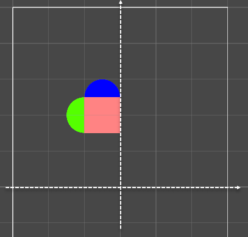

# Coordinate Systems in Unity

### Left-handed Y-Up vs Right-handed Y-Up
- Unity: Left-handed Y-Up
    - X (red): left to right
    - Y (green): down to up
    - Z (blue): front to back


Left-handed Y-Up VS Right-handed Y-Up

### World (Universal) Space

- World space is the coordiate system for **the scene itself**. (Note: not screen)
- Its origin is the **center of the scene**.
- It is a 3D coordinates system and where all of your game objects live.
- It **never** moves.


Drag a gameObject to scene view at position (0, 0, 0) that is the origin of World Space

### Local (Relative) Space

- Local Space is the coordiate system for **the gameOjbect itself**.



### Global vs Local coordianate axes


Global vs Local coordianate axes
*Source:* Unity in Action, 2nd Edition, page 37

### Rotation: *pitch*, *yaw*, and *roll*
- Pitch: X-axis rotation
- Yaw: Y-axis rotation
- Roll: Z-axis rotation


*Source:* Unity in Action, 2nd Edition, page 36


### Screen coordinate system
- **2D**
- measured in **pixels**
- its origin (0, 0) at **lower left corner**
- go to *(Screen.width, Screen.height)*
- depends on the resolution of devices


Screen coordinate with the device resolution 480x800


Screen coordinate with the device resolution 1280x720

### GUI space
- Used by the IMGUI System ([Unity's Immediate Mode GUI System](https://docs.unity3d.com/Manual/gui-Basics.html))
- Identical to Screen coordinates except that they start at (0,0) in the **upper left** and go to (Screen.width, Screen.height) in the lower right.

### Viewport space
- **2D**
- Identical to Screen coordinates
- Start at (0,0) in the **lower left** and go to (1,1) in the upper right 
- No matter what the resolution of device and orientation. For example (0.5, 0.5) in viewport coordinates will be the center of the screen no matter what resolution or orientation.

# Camera and Camera View in Unity
Imagine you are taking a photo with a real camera. Let’s break it down with some questions:

**What is the Camera?**
- Real Camera: A device that captures a specific moment of a part of the real world.
- In Unity:
    - Camera: A component that captures a specific view of the game world (3D world space).

**What is the Camera's View?**
- Real Camera: The part of the real world that is visible through the camera’s lens.
- In Unity:
    - Camera's View: The portion of the game world that is visible through the Unity camera. This is defined by the camera’s field of view (FOV) and its position and orientation in the game world.

**What is the Photo?**
- Real Camera: A container that displays the captured image.
- In Unity:
    - Screen: The 2D surface (like your monitor or mobile screen) where the game is displayed.
    
**What is the Content in the Photo Taken?**
- Real Camera: The real-world scene at a specific moment, captured and displayed as a 2D image.
- In Unity:
    - Rendered Image: The part of the game world captured by the camera and projected onto the screen (2D). This includes all the visible objects, lighting, and effects from the game world at that moment.

**Summary**
- The camera in Unity functions like a real camera, capturing the game world from a specific point of view.
- The camera’s view in Unity is similar to looking through a camera lens, seeing only a portion of the game world.
- The screen acts like the photo, displaying the captured view of the game world in 2D.
- So, in essence, the camera and camera view in Unity work similarly to a real camera and its view, capturing and displaying parts of the game world on your screen.

### Main Camera View vs Screen Coordinate System

- The screen coordinates **are mapped** to the camera's view.
- The main camera projects 3D objects onto a 2D plane (**the screen**).
- Use **ScreenToWorldPoint** and **WorldToScreenPoint** to convert the position between Screen coordinate system and World space.

```
Vector3 world2Screen = Camera.main.WorldToScreenPoint(transform.position);

Vector3 pointOnScreen = new Vector3(240, 400, 0);
Vector3 screen2World = Camera.main.ScreenToWorldPoint(pointOnScreen);
```


# Transform

### position vs localPosition

- position: the position of the transform in **world space**
- localPosition: the position of the transform **relative to the parent transform**

3 game objects: 
- Cicle: 
    - position: (-1, 2, 0)
    - localPosition: (-1, 2, 0)
- Square: child of Cirle
    - localPosition: (0.5, 0, 0)
    - position: (-0.5, 2, 0)
- Circle2: child of Square
    - localPosition: (0.5, 0, 0)
    - position: (0, 2, 0)

*... Starting point*



### Transform.TransformPoint()

- Convert the position from **local space** to **world space**

```
Circle2.transform.localPosition = new Vector3(0, 0.5, 0)
 ```

*Equivalant to*

```

Circle2.transform.position = Square.transform.TransformPoint(new Vector3(0, 0.5, 0))

```

*Result transformed ...*



### Transform.InverseTransformPoint()

- Convert the position from **world space** to **local space**

### Transform.TransformDirection()

- Convert the direction from **local space** to **world space**

### Transform.InverseTransformDirection()

- Convert the direction from **world space** to **local space**

### Transform.TransformVector()

- Convert the vector  from **local space** to **world space**

### Transform.InverseTransformVector()

- Convert the vector from **world space** to **local space**

### Camera.WorldToScreenPoint() and Camera.ScreenToWorldPoint()

- Convert the point from world space to screen space and vice versa

### Camera.ScreenToViewportPoint() and Camera.ViewportToScreenPoint()

- Screen space and viewport space

### Camera.WorldToViewportPoint() and Camera.ViewportToWorldPoint()

- World space and viewport space

### Other Questions
- Canvas? multi canvas?
