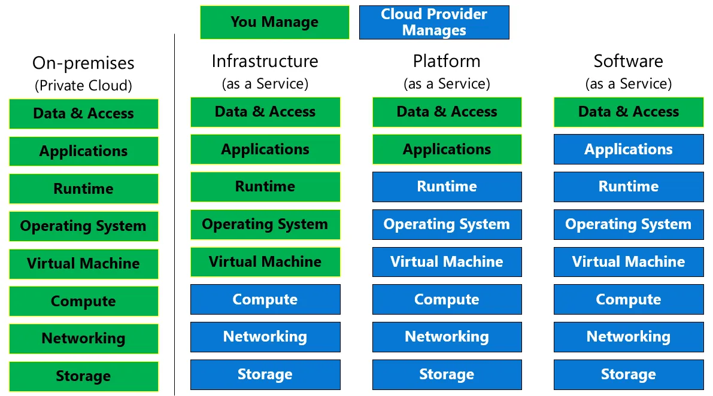

### SaaS, PaaS and IaaS

### Terms

- **Apache Spark**: for distributed data processing and analytics
- **Apache Hadoop**: for distributed storage and processing

- **Database model**: A database model is a conceptual representation of how data is organized and structured in a database. It defines the logical and physical design of a database and serves as a blueprint for creating, modifying, and maintaining the database.

### Storage Account vs Data Lake Storage

|#| Storage Account | Data Lake Storage (Gen2) |
|---|--------| ----|
| Purpose | general-purpose | analytics workloads|
|Access control| SAS (Shared Access Signatures) and BRAC | POSIX-like and BRAC (Role-Based Access Control)
|Hierarchical Namespace (File System)| No | Yes

### AI

- The most common method is called Machine Learning. The way it works is that you **feed lots of real-world data in to a program and the program tries to make a generalization about the data.** This is known as **training a model.**

- **AI Cognitive Services**: pre-built AI tools. These services let you add **AI capabilities** to applications even if you don't know anything about ML.