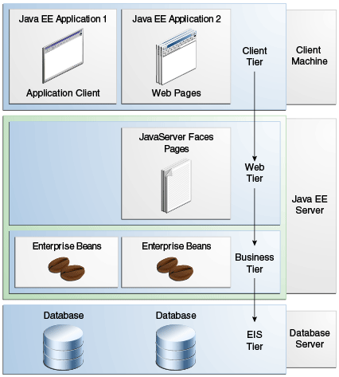

### [Java EE 8](https://javaee.github.io/tutorial/toc.html)

**Enterprise application** is a **large-scale, multitiered, scalable, reliable, and secure network** application.

**Multitiered Aplications**

 
*Source: [The Java EE Tutorial](https://javaee.github.io/tutorial/overview004.html)*

  1. Client Tier
  2. Middle Tier: Web tier and business tier
  3. Data Tier or Enterprise Information System Tier

**Java EE applications** are made up of **components**. A **Java EE component** is a self-contained functional **software unit**:
- that is assembled into a **Java EE application** with its related classes and files
- that communicates with other components

**Java EE components** are written in the Java programming language and are compiled in the same way **as any program** in the language. The differences between Java EE components and "standard" Java classes are that **Java EE components are assembled into a Java EE application**, they are **verified to be well formed and in compliance with the Java EE spec**, and they are deployed to production where they are run and managed by the **Java EE server**.

**Java EE components**:
- Application clients and applets are components that run on the client
- Java EE **web components** that run on the server
  - either servlets or web pages created using **JavaServer Faces technology** and/or **JSP technology** (JSP pages)
- **Business components** that run on the server
  - EJB componets (enterprise beans)

#### Java EE Server and Container Services
**A Java EE server** is **a server application that implements** the Java EE platform API and provides standard Java EE services. Sometimes, it's called **application server**. 

Java EE servers provide **EJB and web containers** that are services for Java EE components.

**Containers** are the interface between a component and the low-level, platform-specific functionality that supports the component.

Before it can be executed, a web component, a enterprise bean or an application client component **must be assembled** into a **Java EE module** and deployed into **its container**

**Web container**:
- is the interface between web components and the web server.
- manages the component's life cycle, dispatches requests to application componets, and provides interfaces to context data, such as information about the current request.

**EJB container**: 
- is the interface between enterprise beans, which provide the business logic in a Java EE app, and the Java EE server.
- manages the execution of enterprise beans for Java EE apps.

**Application client container:**
- is the interface between Java EE application **clients** (special java **SE apps** that use Java EE server components) and the Java EE server.
- runs on the **client machine** and is a **gateway** between the client app and the Java EE server components that the client uses.

Generally speaking, we should understand **why a container is an interface between a component and an application server**, and **why a container is a service for a component?** That's because:

- Java EE platform: is a set of specifications and APIs that provide a standard for developing and deploying enterprise applications.
- A Java application server/A Java EE server like Apache Tomcat, GlashFish, Oracle Weblogic Server, etc. that implements the set of specifications. You, as a web developer, don't care more about how they are implemented, you just care how to use them. They are already services.
- To use them, you need interfaces that are standard interfaces specified by Java EE Platform. These interfaces can be containers. Through these containers, your components can use the underlying services implemented by Java EE servers. So, in the view of your components, it seems the services provided by the containers, and in the view of Java EE servers, the containers are the interfaces between your components and Java EE servers.
- That's all!