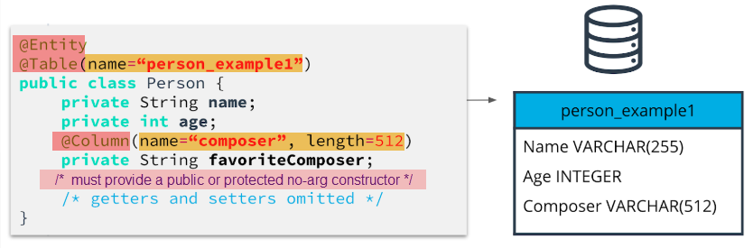
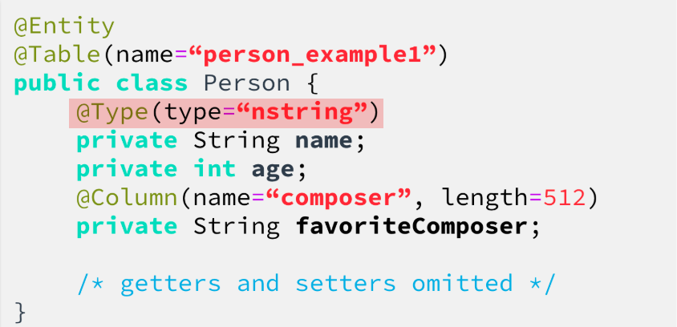
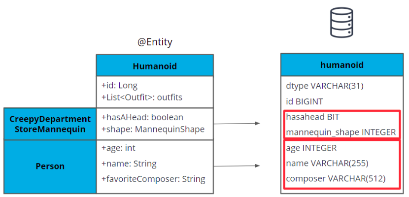
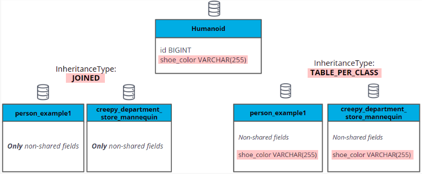
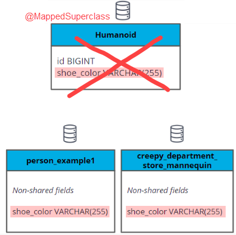
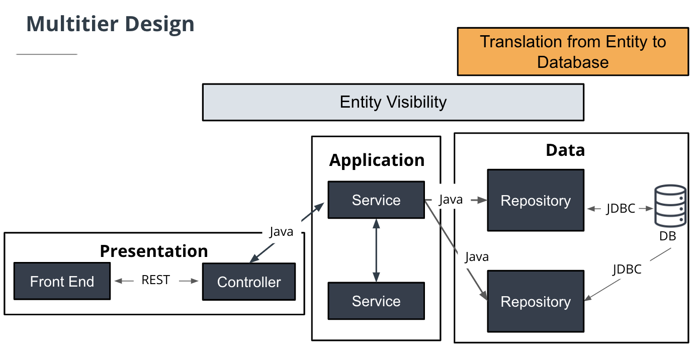
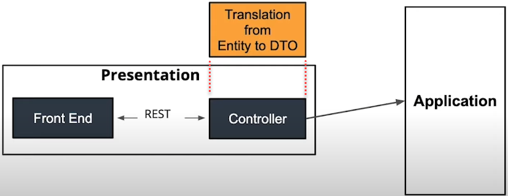
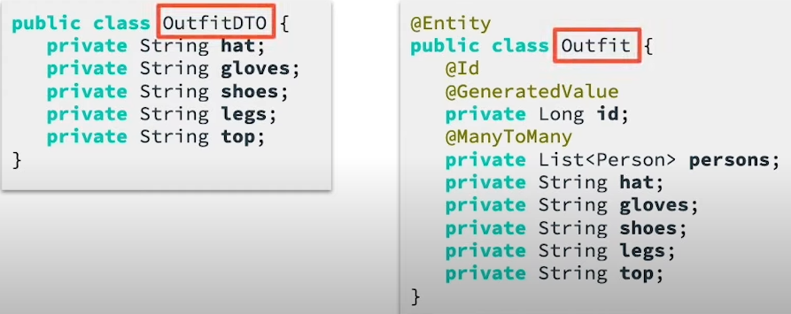

### Data in Multi-Tier Architecture

- **Multi-tier Architecture** is a term used to refer to a form of design that **separates** various functions of the application into their own **layers**.

- **Goal**: Understand how data in our application is defined and used across these layers.

#### Lesson Outline

1. Value types vs Entity types
2. Basic Types in Java and JDBC
   
   A Basic Type acts as an **intermediary**   between a Java field type and a type definition provided by JDBC.
3. Identifiers
4. Relationships
5. Inheritance

#### 1. Value Types vs Entity Types

**Entity Types**

Java classes that describe a collection of data. 

- Contain **data only**, no behavior
- Represented by **a table in the db**

**Value Types**

The data inside an Entity

- Primitives like int, boolean, char
- Classes that only represent **a single piece of data**, like BigInteger or LocalDate
- Represented by **a column in the db**

**Define an Entity type**


_@Entity, @Table, @Column annotations_

**_Remember_**: Entity classes must provide a public or protected 

##### Further Reading
[Hibernate Documentation on Mapping Types](https://docs.jboss.org/hibernate/orm/current/userguide/html_single/Hibernate_User_Guide.html#mapping-types)

#### 2. Basic Types

- Basic Types map a single database column to a single, non-aggregated Java type.

- [Full List of Hibernate standard Basic Types](https://docs.jboss.org/hibernate/orm/5.4/userguide/html_single/Hibernate_User_Guide.html#basic)
- Hibernate selects default BasicTypes for you, but you can override by specifying the **@Type** annotation, as below.



#### 3. Identifiers

Using the ```@Id``` annotation

```
@Entity
public class Person {
    @Id
    @GeneratedValue
    Long id;
   / *rest of class* /
}
```

```@GeneratedValue``` annotation indicates that this value to be assigned automatically.

**_Recommend_**: Hibernate recommends using the **long or integer wrapper classes** as identifiers

##### Composite Identifiers

Composite identifiers combine multiple attributes to define uniqueness.

Here are the rules governing composite identifiers, as defined by the Jakarta Persistence specification:

- The composite identifier must be represented by a "primary key class". 
- The primary key class must be public and must have a public **no-arg constructor**.
- The primary key class must be **serializable**.
- The primary key class must define **equals and hashCode methods**, consistent with equality for the underlying database types to which the primary key is mapped.
... [Source - detail of the documentation here](https://docs.jboss.org/hibernate/orm/current/userguide/html_single/Hibernate_User_Guide.html#identifiers-composite)

##### Using @Embeddable and @EmbeddedId

**PersonPK.java - The Primary Key Definition**

```
@Embeddable
public class PersonPK implements Serializable {
   private int heightCm;
   private String sockColor;

   @Override
   public boolean equals(Object o) {
       if (this == o) return true;
       if (o == null || getClass() != o.getClass()) return false;
       PersonPK personPK = (PersonPK) o;
       return heightCm == personPK.heightCm &&
               sockColor.equals(personPK.sockColor);
   }

   @Override
   public int hashCode() {
       return Objects.hash(heightCm, sockColor);
   }

  / * getters and setters* /
}
 ```

**Person.java - The Entity**
```
@Entity
public class Person {
   @EmbeddedId
   PersonPK id;

  / *rest of class* /
}
 ```

##### Using @IdClass

- The ```@IdClass``` annotation allows you to specify a composite primary key by **shadowing** the fields of the **key class** in the Entity. In other words, the Entity class must have its own attributes with **the same names** as the fields in the key class. This approach can be useful if you must use an object as a primary key that **cannot be @Embeddable** such as to support legacy or 3rd-party code. It means in cases that you **do not have access** to modify the composite key class.

**PersonPK.java - without @Embeddable** 

```
public class PersonPK implements Serializable {
   private int heightCm;
   private String sockColor;

   @Override
   public boolean equals(Object o) {...}

   @Override
   public int hashCode() {...}
   / *getters and setters*/
}
 ```

**Person.java - The Entity**

```
@Entity
@IdClass(PersonPK.class)
public class Person {
   @Id
   private int heightCm;
   @Id
   private String sockColor;

   public PersonPK getId() {
       PersonPK id = new PersonPK();
       id.setHeightCm(heightCm);
       id.setSockColor(sockColor);
       return id;
   }

   public void setId(PersonPK id) {
       this.heightCm = id.getHeightCm();
       this.sockColor = id.getSockColor();
   }
   / *getters and setters* /
}
 ```

##### @EmbbededId vs @IdClass

- @EmbbededId is over @IdClass
- @EmbbededId makes it much more apparent when querying and accessing an object
- @EmbbededId also facilitates object-oriented querying and access through Hibernate.
- That said, there are some cases that must use @IdClass as mentioned above.

#### Further Reading
[Hibernate documentation on Composite Keys](https://docs.jboss.org/hibernate/orm/current/userguide/html_single/Hibernate_User_Guide.html#identifiers-composite)

**Question:** Where do @Embeddable and @IdClass Composite Keys get stored?

- Of course, they are stored in the **same table** as the rest of the Entity.

#### 4. Relationships

##### @Embeddable for Dependent Relationships

- We can also use @Embeddable annotation to embed **non-ID objects** into entities like with composite identifiers.
- All fields in the embeddable objects simply become new columns in the parent entity table. From the database perspective, it appears as if the attributes of the embeddable were just attributes of the parent entity.
- Embeddable objects are used to define classes that have a **dependent relationship** with the entity in which they are contained.

**For example**: 

- If we wanted to store information about what clothes each person entity **was wearing**, we could store all that data in a **separate** class and include that class as an attribute of our person entity. 
- In this case, a outfit object is as a dependent object. It does not exist outside the context of a person entity.

**Outfit.java - A separate class**


```
@Embdeddable 
public class Outfit {
    private String hat;
    private String top;
    private String legs;
    private String shoes;
    private String gloves;

    /*getters and setters*/
}
 ```

**Person.java - The Entity**

```
@Entity
@Table(name="person_example")
public class Person {
   @Id
   @GeneratedValue
   private Long id;

   private Outfit outfit;

   /*rest of class*/
}
 ```

- In the database perspective, all attributes of Outfit such as _hat, top, etc_ are **as columns** in the **_person_example_** table.

##### Unidirectional Association - OneToOne

- Now, we change the Outfit to Entity and make a unidirectional association from **Person** to **Outfit**.

```
@Entity
@Table(name = "Outfit")
public class Outfit {
    @Id
    @GeneratedValue
    private Long id;
    ...
}

@Entity
@Table(name="person_example")
public class Person {
    @Id
    @GeneratedValue
    private Long id;
    
    @OneToOne
    @JoinColumn(name = "outfit_column")
    private Outfit outfit;

   /*rest of class*/
}
 ```

- **Unidirectional** - Association specified on one side of the relationship only. In the example, we only specify the association from **person** to **outfit**.

```
@OneToOne
@JoinColumn(name = "outfit_column")
Outfit outfit;
 ```

- This tells Hibernate that for each **one person** we expect to have **one outfit**. If we look up a person, we will also get the corresponding outfit. But, if we lookup an outfit, we don't know who it belongs to.
- In the database perspective, the **_person_example_** table has a column named _outfit_column_ as a foreign key to the Outfit.

##### Bidirectional Association - OneToOne

- Now, we change the **Unidirectional Association** to **Bidirectional Association**.
- Similar to Person Entity, we can add a *person* attribute with the *@OneToOne* annotation on Outfit Entity like this:

```
@Entity
@Table(name = "Outfit")
public class Outfit {
    @Id
    @GeneratedValue
    private Long id;

    @OneToOne
    private Person person;
    ...
}

@Entity
@Table(name="person_example")
public class Person {
    @Id
    @GeneratedValue
    private Long id;
    
    @OneToOne
    @JoinColumn(name = "outfit_column")
    private Outfit outfit;

   /*rest of class*/
}
 ```

- That's it. Now, if we lookup an outfit, we will also get the person associated with it.
- In the database perspective, the **_Outfit_** table has also a column named _person_ as a foreign key to the Person.
- So, there are **two foreign key constraints** in both of the related tables.

##### Use *mappedBy* to eliminate the second foreign key constraint

- Add the ```mappedBy``` attribute on the **child side of the relationship**. 
- The child side usually the primary entity class. It makes sense to let the **contained entity class table** to control the foreign key constraint. [Refer to documentation @OneToMany and @ManyToOne to understand it.](https://docs.jboss.org/hibernate/orm/current/userguide/html_single/Hibernate_User_Guide.html#associations-one-to-many-bidirectional) 

```
@Entity
@Table(name = "Outfit")
public class Outfit {
    @Id
    @GeneratedValue
    private Long id;

    @OneToOne
    private Person person;
    ...
}

@Entity
@Table(name="person_example")
public class Person {
    @Id
    @GeneratedValue
    private Long id;
    
    @OneToOne(mappedBy = "person")
    private Outfit outfit;

   /*rest of class*/
}
 ```

- In the database perspective, Hibernate will create **a join column in the table Outfit** with a foreign key constraint to **person_example**

```
    @OneToOne(mappedBy = "person")
    private Outfit outfit;
 ```

- This let Hibernate know how to look up the relationship in **both directions** without creating a second foreign key constraint.

##### Unidirectional - @OneToMany

- You only need to specify the Entity on a single side of the relationship. For example, this is the Person class showing a unidirectional @OneToMany relationship to Outfit.

```
@Entity
public class Person {
   @Id
   @GeneratedValue
   private Long id;

   @OneToMany
   private List<Outfit> outfits;

   / *rest of class* /
}

@Entity
public class Outfit {
   @Id
   @GeneratedValue
   private Long id;

   / *rest of class* /
}
 ```

##### Bidirectional - @OneToMany and @ManyToOne

- Both classes have a reference to each other. Here is a bidirectional @OneToMany relationship showing that one person has many outfits, and each outfit has one person.

```
@Entity
public class Person {
   @Id
   @GeneratedValue
   private Long id;

   @OneToMany(mappedBy = "person")
   private List<Outfit> outfits;

   / *rest of class* /
}

@Entity
public class Outfit {
   @Id
   @GeneratedValue
   private Long id;
  
   @ManyToOne
   private Person person;

   / *rest of class* /
}
 ```

##### @ManyToMany

- [Read details here](https://docs.jboss.org/hibernate/orm/current/userguide/html_single/Hibernate_User_Guide.html#associations-many-to-many)

##### @ElementCollection

- An association between a single Entity and a list of values that are **not themselves Entities**.
- This annotation let you persist lists of **Embeddable or Enum or String or etc**.
- For the example, these embeddables will be stored in a **separate** table, along with the **id of the Entity** in which they are contained.

```
@Entity
public class Person {
   @Id
   @GeneratedValue
   private Long id;

   @ElementCollection
   private List<Outfit> outfits;

   / *rest of class* /
}

@Embeddable
public class Outfit {
   private String hat;
   private String gloves;
   private String shoes;
   private String legs;
   private String top;
}
 ```

##### Types of Entity Associations

- **OneToOne**: Single Entity on each side of the relationship.
- **OneToMany** and **ManyToOne**: List of Entities on one side, single Entity on the other.
- **ManyToMany**: Lists of Entities on both sides.

##### Notes: 

1. **Bidirectional Association**: must have one **owning side only** (the child side), the other one being **referred** to as the *inverse* (or the *mappedBy*) side.
   
   - Whenever a bidirectional association is formed, the application developer must **make sure both sides are in-sync** at all times.

2. In database perspective:

- ```@ManyToOne```: add a new column as a foreign key
- ```@OneToMany```: add a new link table
- In the **Bidirectional Association** of ```@OneToMany``` as an owning side and ```@ManyToOne``` as a referring side (```@mappedBy```): add a new column as foreign key in the owning table.

##### Further Reading 

- [Hibernate Documentation of Associations](https://docs.jboss.org/hibernate/orm/current/userguide/html_single/Hibernate_User_Guide.html#associations)

#### 5. Inheritance

```
@Entity
public abstract class Humanoid {
   @Id
   @GeneratedValue
   Long id;

   @OneToMany(mappedBy = "humanoid")
   List<Outfit> outfits;

   / *getters and setters* /
}

@Entity
public class Person extends Humanoid {

   @Type(type="nstring")
   private String name;
   private int age;
   @Column(name="composer", length=512)
   private String favoriteComposer;

   / *getters and setters* /
}

@Entity
public class CreepyDepartmentStoreMannequin extends Humanoid {

   private boolean hasAHead;
   private MannequinShape mannequinShape;

   enum MannequinShape {
       LITHE, MUSCULUR, UNASSUMING;
   }

    / *getters and setters* /
}
 ```

##### Single Table Inheritance

- The **default** inheritance strategy used by Hibernate is Single Table inheritance.
- All the fields of the parent and children classes are stored in the same table.
- Allows the fastest polymorphic queries because no tables need to be joined to access all subclasses.
- **Cannot support Not Null column** constraints because columns must be able to contain null for sibling classes.


*Single Table Inheritance*

##### Other Inheritance Strategies

**Some valid choices**

- InheritanceType.**SINGLE_TABLE**
- InheritanceType.**JOINED**
- InheritanceType.**TABLE_PER_CLASS**

```
@Entity
@Inheritance(strategy = InheritanceType.JOINED)
public class Humanoid {
   @Id
   @GeneratedValue
   Long id;

   @OneToMany(mappedBy = "humanoid")
   List<Outfit> outfits;

   / *getters and setters* /
}
 ```



##### @MappedSuperclass Annotation

- This option is similar to the type ```InheritanceType.TABLE_PER_CLASS``` but there is **no parent** table created.


_No parent class created_


**Inheritance Summary**

- **Single Table**: Store all subclasses in one table. **FASTEST polymorphic queries but CANNOT support NOT NULL column**
- **Joined Table**: One table per entity, including parent. Parent fields **not duplicated** in subclass tables. **Support polymorphic queries AND NOT NULL column**.
- **Table Per Class**: One table per entity, including parent. Parent fields **duplicated** in subclass tables. **Support polymorphic queries AND NOT NULL column.** This strategy can be used in case of you do not expect to use polymorphic queries but want to be able to if you need to in the future.
- **Mapped Superclass**: One table per subclass, **not parent** class table. **Does not support polymorphic queries.**

**(*) polymorphic query**: A query for the parent class that returns elements of all subclass types..

##### Further Reading

- [Hibernate Documentation on Inheritance](https://docs.jboss.org/hibernate/orm/current/userguide/html_single/Hibernate_User_Guide.html#entity-inheritance)

#### Entity Role in Multitier Architecture

- The entities act as a bridge between the needs for application layer and the structure of the database. As such, the entities belong in the **data layer** of our application, which coordinates the communication between the application layer and the database.
- The data layer will contain all the entity definitions for a program, as well as the classes that use those entities to talk to the database.



#### Data Conversion between Front-end and Controller

**2 Options:**

1. Data Transfer Objects (DTOs): This approach is similar to Entity but data structures designed to represent for the needs of the front ends instead of database.
2. ```@JSONView``` annotation: This approach allows us to **filter which entity data** is visible to the presentation layer.

##### Data Transfer Objects (DTOs)
**Concept:**

- For each request our controller supports, we create a new object representing the structure of any input or output data needed by the request. These objects **should not** be referenced outsider our controller classes because they define a data format specific to the endpoints provided by that controller.
- Any exchanges with the service layer will involve **transforming the data between the entity and the DTO**. This translation should happen inside the controller, just like the translation between entity and database happens inside the data layer. The service layer **should not** be required to know what shape your DTOs take.


*Data Translation Entity to DTOs should happen inside controllers*

**Purposes:**

- The primary purpose of DTOs is to **encapsulate specific data** that needs to be exchanged, simplifying the interaction betwen the browser and the REST client.
- Another purpose of DTOs is to reduce the total amount of data exchanged.


*OutfitDTO represents a smaller amount of data than Outfit entity*

**DTO Summary**
- Simplify and document interaction between front end and Controller.
- Conceal/hide database structures.
- Limit the amount of data exchanged.
- Customize display data to meet the needs of the front end.

##### ```@JSONView``` annotation

- Annotation that filters which Entity data is visible to the Presentation layer. With this approach, the principle of _Separation of Concerns_ affected.

**How to apply @JSONView?**

- Step 1: Create an interface 
```
public class Views {
    public interface Public {}
}
 ```

- Step 2: Determine which fields of an entity should be filtered with ```@JSONView```

```
@Entity
@Table(name="deliveries")
public class Delivery {
    @JsonView(Views.Public.class)
    @Nationalized
    private String recipientName;

    @JsonView(Views.Public.class)
    @Column(name="address_full", length=500)
    private String address;

    ...
}
 ``` 
- Step 3: Add ```@JSONView``` to the request handlers

```
@RestController
@RequestMapping("/delivery")
public class DeliveryController {
    @Autowired
    private DeliveryService deliveryService;

    @JsonView(Views.Public.class)
    @GetMapping("/list/{name}")
    public List<Delivery> getDeliveries(@PathVariable String name) {
        return deliveryService.getDeliveries(name);
    }

    ...
}
 ```

**@JSONView summary**

- Quickly specify which parts of Entities should be visible to which consumer.
- Often a simple choice when **controlling full stack**.
- **Not as helpful** when you need to combine data from multiple Entities.
- Can require Entity updates if front end needs change.
- Often grouped together in a Views class, containing interfaces such as ‘Public’, ‘Private’, or interfaces named for specific endpoint recipients.

##### Quiz Question

Check each entry that should have DTOs created, leave blank each entry that should use @JSONView

 - [x] Your front end is maintained by a team of web developers and your back end is managed by DBAs.
 - [ ] You’re trying to quickly prototype a full-stack application.
 - [x] Your front end is a single-page application that requires data from multiple entities.
 - [x] Your legacy application Entities are extremely large.
 - [ ] Your Entities match your front end but contain some sensitive information.
