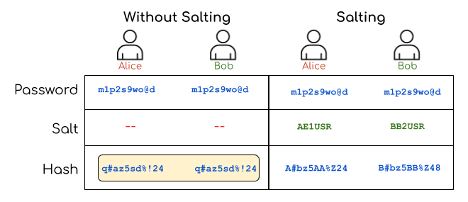
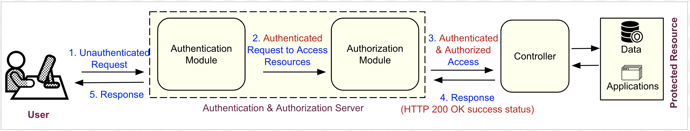
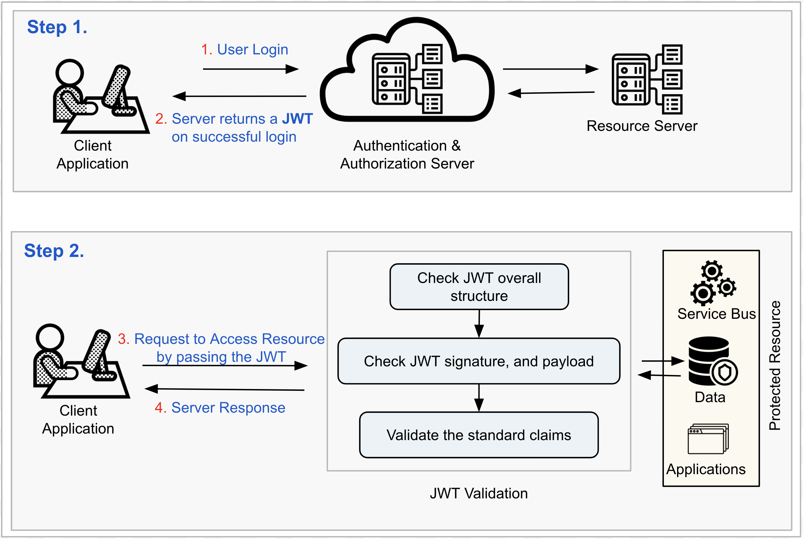

## Authentication and Authorization

### Authentication

#### Common Mechanisms for Authentication

- Token-based authentication: [Read more here](https://scotch.io/tutorials/the-ins-and-outs-of-token-based-authentication)
- OAuth: [Read more here](https://auth0.com/docs/protocols/oauth2)
- Time-based Token (TOTP) [Read more here](https://www.freecodecamp.org/news/how-time-based-one-time-passwords-work-and-why-you-should-use-them-in-your-app-fdd2b9ed43c3/)
- Biometric authentication

**More to Explore - Network Authentication Protocols** [Kerberos](https://www.kerberos.org/docs/index.html)


**[OWASP authentication cheatsheet](https://github.com/OWASP/CheatSheetSeries/blob/master/cheatsheets/Authentication_Cheat_Sheet.md)**

#### Hashing

- Hashing must be irreversible
- And each input should have a unique output

**Where to use ```Hashing``` in an application?**

- To store any **sensitive information** in the system, such as user passwords

**Some famous Hashing Algorithms**

- MD5
- SHA
- **bCrypt**
- **sCrypt**

#### Salting

- A salt is random data that is used as an additional input to the hash function so that the final hash becomes more secure.
- Salting is an approach to generate two **different hash values** for two different users providing **the same input**.



**Points to Consider**

1. In a web app, the **Salting** must be done on the server
2. While hashing user passwords, the **Salt** should be generated randomly for each user's password
3. For **numeric** Salt, it is good to use secure algorithms such as Cryptographically Secure Pseudo-Random Number Generator (CSPRNG). In Java, using ```java.security.SecureRandom``` class for generating PRNG
4. For pseudo-random **alpha-numeric** string generator, you may use ```org.apache.commons.text.RandomStringGenerator```
5. When we use **Salting**, there are two separate steps involved:
   
   - Generate the **salted** password, and
   - Verify the **salted** password

### Authorization


_Basic authentication and authorization steps_

#### JSON Web Token - JWT 

- JSON Web Token (JWT) is an open standard [RFC 7519](https://tools.ietf.org/html/rfc7519), that defines a compact and **self-contained** way for securely transmitting information between parties as a JSON object
- JWTs are used for authentication in RESTful microservices architecture
- **REST** (REpresentational State Transfer) is a software-architectural style, in which there is **stateless** communication between client and server. It means that the server doesn't have to store the user cookies or other session data for any incoming request. Rather, the server authenticates a user based on a token (JWT)

#### JWT Structure

```{header}.{payload}.{signature}```

**Header:**

- ```typ```: the type of the token
- ```alg```: the signing algorithm being used

*For example:* 

```
{
  "alg": "HS256",
  "typ": "JWT"
}
 ```

Encode the header with **Base64Url** to form the first part of the JWT.

**Payload:**

- contain the claims 
- **claims** are statements about an entity (typically, the user) and additional data.

*For example:*

```
{
  "sub": "1234567890",
  "name": "John Doe",
  "admin": true
}
 ```

Encode the payload with **Base64Url** to form the 2nd part of the JWT.

**NOTE: Do not put secret information in the payload or header elements of a JWT**

**Signature**

- To take the encoded header, the encoded payload and a secret
- Use the algorithm specified in the header to sign that

*For example:*

```
HMACSHA256(
  base64UrlEncode(header) + "." +
  base64UrlEncode(payload),
  secret)
 ```

#### How does it work?


_How to generate a JWT and use it_

**Further reading:**

- [JWT.io](https://jwt.io/introduction/) a useful guide and list of popular JSON Web Token implementations
- [Base64Url Encoding](https://en.wikipedia.org/wiki/Base64)
- [HMAC](https://en.wikipedia.org/wiki/HMAC) keyed-hash message authentication code

### JWT Implementation

#### Packages

Add 2 packages to ```pom.xml```:

**Spring Security**: Should use tool Spring initializer to get it

```
<dependency>
    <groupId>org.springframework.boot</groupId>
    <artifactId>spring-boot-starter-security</artifactId>
</dependency>
<dependency>
    <groupId>org.springframework.security</groupId>
    <artifactId>spring-security-test</artifactId>
    <scope>test</scope>
</dependency>
 ```

**java-jwt**: Should get the latest version at [link](https://central.sonatype.com/artifact/com.auth0/java-jwt/4.4.0)

```
<dependency>
    <groupId>com.auth0</groupId>
    <artifactId>java-jwt</artifactId>
    <version>4.4.0</version>
</dependency>
 ```

#### Spring Boot Security Auto-Configuration

[Read more detail here](https://www.baeldung.com/spring-boot-security-autoconfiguration)

- _SecurityAutoConfiguration_ class containing the **initial/default security configuration**
- To discard the security auto-configuration and add our own configuration, we need to exclude the SecurityAutoConfiguration class. 2 ways:

```
@SpringBootApplication(exclude = { SecurityAutoConfiguration.class })
public class SpringBootSecurityApplication {
    public static void main(String[] args) {
        SpringApplication.run(SpringBootSecurityApplication.class, args);
    }
}
 ```

*Or from file ```application.properties```:*

```
spring.autoconfigure.exclude=org.springframework.boot.autoconfigure.security.SecurityAutoConfiguration
 ```

#### Further Reading
- Official Guide on [Spring Security Architecture](https://spring.io/guides/topicals/spring-security-architecture/)
- StackOverflow discussion thread on [Basics of Spring Security](https://stackoverflow.com/questions/67329660/basics-of-spring-security/67331836#67331836)
- StackOverflow discussion thread on [How Spring Security Filter Chain works](https://stackoverflow.com/questions/41480102/how-spring-security-filter-chain-works)
- An article on Backendstory.com [Spring Security: Authentication Architecture Explained In Depth](https://backendstory.com/spring-security-authentication-architecture-explained-in-depth/)
- Official Docs [Configuration Migrations](https://docs.spring.io/spring-security/reference/5.8/migration/servlet/config.html) - Spring Security 5.8.6
- One more thread on [Configuration Migrations with WebSecurityConfigurerAdapter Deprecated](https://www.linkedin.com/pulse/solved-deprecated-websecurityconfigureradapter-mateus-nascimento/)
- [Extra Login Fields with Spring Security](https://www.baeldung.com/spring-security-extra-login-fields)