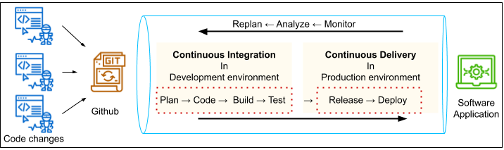
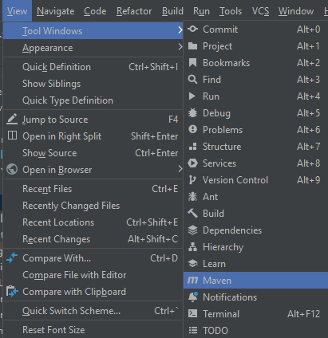
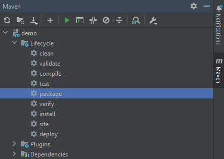
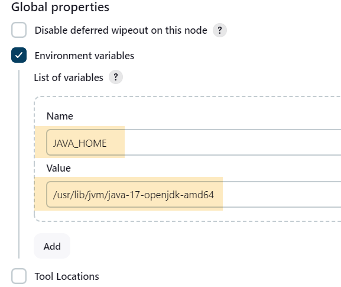
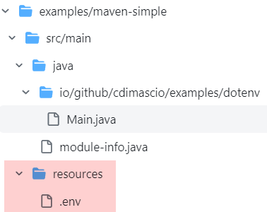
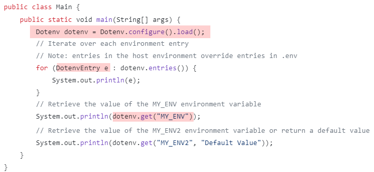

## Continues Integration/Continuous Delivery (CI/CD)

You should be proficient in tools such as: **Git, AWS, Docker, Jenkins**



### Docker

#### How does it work?

3 steps: **Dockerfile → Docker Image → Docker Container**

**1. Write a Dockerfile**

- Dockerfile is a text document that contains the commands a user would execute on the command line to assemble an image.
- In this file, you can specify the necessary environments and dependencies.

*Example:*

```
# Pull the "tomcat" image. The community maintains this image. 
FROM tomcat 

# Copy all files present in the current folder to the "/usr/local/tomcat/webapps" folder 
COPY ./*.* /usr/local/tomcat/webapps 
 ```

**Explain the example:**

- In the example above, every time you create a container, it will have the tomcat web server installed.
- In addition, all the contents of the current directory will also be copied to the */usr/local/tomcat/webapps* folder of each container.

**Other examples**

See another Dockerfile from [link](https://github.com/docker/labs/blob/master/beginner/static-site/Dockerfile)

```
FROM nginx
ENV AUTHOR=Docker

WORKDIR /usr/share/nginx/html
COPY Hello_docker.html /usr/share/nginx/html

CMD cd /usr/share/nginx/html && sed -e s/Docker/"$AUTHOR"/ Hello_docker.html > index.html ; nginx -g 'daemon off;'
 ```

[Dockerfile reference](https://docs.docker.com/engine/reference/builder/) 

**2. Build an Image**

Use ```docker build``` command to build an image from the Dockerfile. Usually, we execute this command from the same directory where the Dockerfile is present.

```
# This command will look for a Dockerfile in the `pwd`, and create myImage
docker build  --tag myImage  [OPTIONS] path_where_to_store_the_image 
 ```

**DockerHub**: 

- A centralized place, called **Container Registry**, to store container images
- You can store your images online at DockerHub as well, so that you/anyone can ***pull*** them on any other machine, anytime. So, these images are **pre-created images**.
- And if you *pull* an image from *DockerHub*, you only *create and run a container* at step 3 and by-pass step 1 and step 2.

- Use ```docker pull``` command to pull an image from DockerHub:

```
docker pull tomcat:latest
 ```

**3. Create and run a Container**

- After creating an image, you can use it to **create as many Container as you want on any platform**.
- Each container created will have the same environment and dependencies to run a copy of your app.
- Use ```docker run``` command to **create and run a container:**

```
docker run --name myContainer myImage
 ```

#### Docker basic commands

- ```docker images``` : list the available images
- ```docker ps``` : list all the running containers
- ```docker build .``` : run the *Dokcerfile* to create an image
- ```docker run {IMAGE_ID}``` : create and run a container with the specified image
- ```docker exec -it {CONTAINER_ID} bash``` : open a bash terminal inside the container
- ```docker stop {CONTAINER_ID}``` : stop a running container
- ```docker container rm {CONTAINER_ID}``` : remove a specified container
- ```docker kill {CONTAINER_ID}``` : terminate a specified container

- ```docker --help```
- ```docker {COMMAND} --help``` : for more info on a command, such as: ```docker container --help```

***Note:*** Start/stop a service in Amazon Linux

- ```sudo service {service_name} start```
- ```sudo service {service_name} stop```

#### Useful Tip

If you want run any command in the container, there are **2 options to do that.**

**1. Use ```bash shell``` in the container**

```docker exec -it {CONTAINER_ID} bash```

**2. Use ```docker exec``` command**

```docker exec -it {CONTIANER_ID} <command>```

#### Further Reading

- [Docker Overview](https://docs.docker.com/get-started/overview/)
- [Docker Containers](https://www.docker.com/resources/what-container/)


### Jenkins

- Jenkins is an open-source automation server.
- **An automation server** is a software tool that helps automate various tasks and processes in software development. It acts as a **central hub** for managing and executing automated tasks related to building, testing, and deploying software.
- **Jenkins + other tools → CI/CD pipeline**


_A CI/CD Pipeline showing the role of Jenkins automation server building and deploying multiple environments on the server available in the Cloud_

**Quiz Question**

Select all statements that are correct with regard to a CI/CD pipeline?

  - [x] A pipeline helps you automate steps in your software delivery process, such as initiating automatic builds, tests and then deploying to the server (Amazon EC2 instances).
  - [x] A pipeline rebuilds, and deploys every time there is a change in code.
  - [x] The code must be available in a version control system such as GitHub or the cloud storage.

***Note:*** [Install Java in EC2 instances](https://linux.how2shout.com/how-to-install-java-on-amazon-linux-2023/)

#### Further Reading

- [Jenkins official documentation](https://www.jenkins.io/doc/pipeline/tour/getting-started/)
- [Build a Java App with Maven](https://www.jenkins.io/doc/tutorials/build-a-java-app-with-maven/)

### Deploy a Spring Boot app

**1. Deploy a war file built on a web server (like Tomcat) installed on EC2 instance**
- *Step 1:* Update ```pom.xml``` :

```
<packaging>war</packaging>
 ```

```
<dependency>
    <groupId>org.springframework.boot</groupId>
    <artifactId>spring-boot-starter-tomcat</artifactId>
    <scope>provided</scope>
</dependency>
 ```

- *Step 2:* ```extends SpringBootServletInitializer ```

```
@SpringBootApplication
public class DemoApplication extends SpringBootServletInitializer {
	public static void main(String[] args) {
		SpringApplication.run(DemoApplication.class, args);
	}
}
 ```

- *Step 3:* package the project into war file. 

On IDE Intellij as following:





- *Step 4:* copy the war file to folder ```webapps``` of Tomcat. For example: 

```
scp -i .ssh/rdav-aws-server.pem demo.war ec2-user@52.77.233.139:/usr/local/tomcat10/webapps
 ```

- *Step 5:* Restart Tomcat server

**Refer to [How to install Tomcat on Linux](https://www.digitalocean.com/community/tutorials/install-tomcat-on-linux)**

**Refer to [How to install and use Docker](https://www.digitalocean.com/community/tutorials/how-to-install-and-use-docker-on-ubuntu-20-04)**

**2. Deploy automatically using CI/CD**

- TBD

#### Some quick notes with Jenkins

1. We can set environment variables: 

- Follow the flow: ```Manage Jenkins > System > Global Properties: Environment variables [checked]```

- Then add environment variables. Such as, add JAVA_HOME as below:



2. So far, Jenkins does not support Tomcat 10 or later, which is based on Servlet API 5.0 (Jakarta EE 9) or later with ```jakarta.servlet``` imports.. [Read more](https://www.jenkins.io/doc/administration/requirements/servlet-containers/#support-levels). 

- [Spring Framework 6 Requires JDK 17+ and Jakarta EE 9++](https://github.com/spring-projects/spring-framework/wiki/What%27s-New-in-Spring-Framework-6.x/#whats-new-in-version-60)

- So, just use Jenkins for Spring applications developed with Spring 5.x.

#### Set environment with ```.env``` file

- We can load environment variables with [dotenv-java](https://github.com/cdimascio/dotenv-java)
- How to use dotenv-java? [Look at a Maven example here](https://github.com/cdimascio/dotenv-java/blob/master/examples/maven-simple/src/main/java/io/github/cdimascio/examples/dotenv/Main.java)

```
<dependency>
    <groupId>io.github.cdimascio</groupId>
    <artifactId>dotenv-java</artifactId>
    <version>3.0.0</version>
</dependency>
 ```


_The place of .env file_


_The way of using dotenv package_

**Note:** It's important to bear in mind that if **sensitive data** is stored in .env, that it must **not be stored under version control**.

#### [Skipping Tests with Maven](https://www.baeldung.com/maven-skipping-tests)

```
<properties>
    <maven.test.skip>true</maven.test.skip>
</properties>
 ```
