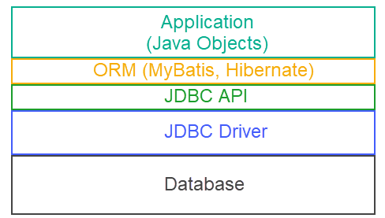
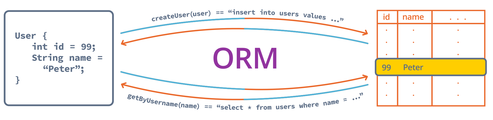
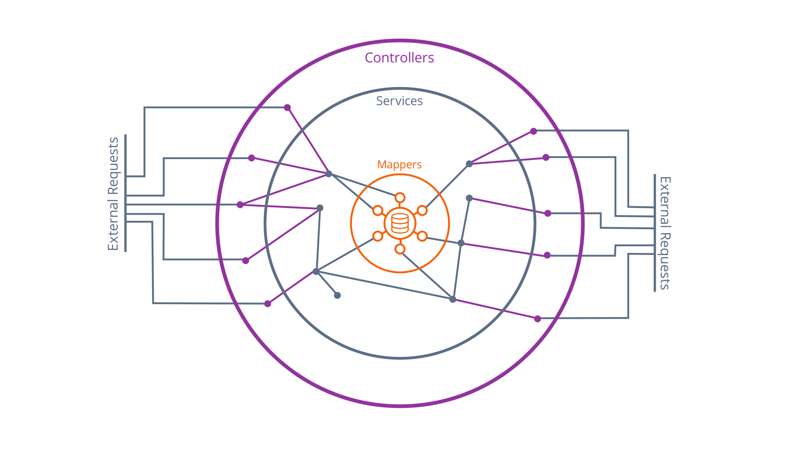

### Data Persistence and Security

#### How does an application interact with a database?


**What is JDBC API?**

- JDBC API is a standard Java API that provides a set of classes and interfaces for database connectivity. 
- JDBC helps you to write Java applications that manage these three programming activities:
  1. Connect to a data source, like a database
  2. Send queries and updates statements to the database
  3. Retrieve and process the results received from the database in answer to your query

Read the following articles: 

- [JDBC - a short guide](https://www.marcobehler.com/guides/jdbc)
- and [JDBC Overview](https://docs.oracle.com/javase/tutorial/jdbc/overview/index.html)

**Relationship between _Application_, _ORM_, _JDBC API_, _JDBC Driver_, _Database_**



#### ORM - Object-Relational Mapping
- _Mapping_: Drawing a relationship between a field in a Java class and a column in a SQL table
- _ORM_: A general term describing a set of technology that can be used to automatically convert data between database representation and application representation


_ORM Process Visualization_

#### MyBatis

[Official MyBatis V3.5 Documentation](https://mybatis.org/mybatis-3/index.html)

MyBatis provides a '**shallow**' ORM layer over JDBC. That means it helps map your _Java objects_ to _queries_ that save and retrieve data **using JDBC**.

What means '**shallow**'? The term 'shallow' refers to the **level of abstraction** provided by the ORM layer. A 'shallow' ORM layer means that MyBatis does **not attempt** to **fully abstract** away the underlying JDBC code. Instead, it provides a simplified and lightweight mapping between java objects and SQL queries, while still allowing you to **use JDBC directly if needed.**

Compared to a '**deep**' ORM layer, MyBatis gives you more control and flexibility. Because a 'deep' ORM layer whose abstraction is more comprehensive **but can sometimes limit** your ability to optimize and fine-tune the database interactions.

With MyBatis, you can still **write SQL queries** and have **direct access to the JDBC API** when necessary, while benefiting from the convenience of mapping Java objects to database tables. 

**How to work with MyBatis?**

MyBatis is mostly used through **interface definitions**. MyBatis **automatically generates** classes that implement the interface and **makes them available** as **Spring beans** in the Spring application context.

[Full list of the _MyBatis_ type mapping](https://mybatis.org/mybatis-3/configuration.html#typeHandlers)

**Examples**
```
@Mapper
public interface UserMapper {
   @Select("SELECT * FROM USERS WHERE username = #{username}")
   User getUser(String username);
}
```

By default, MyBatis will match query result columns to Java class fields by name and uses getters and setters to access them. Just like any POJO. 

If Java field names don't match the SQL columns names exactly, you're going to do some additional configuration.

```
@Mapper
public interface UserMapper {
   @Insert("INSERT INTO USERS (username, salt, password, firstname, lastname) " +
           "VALUES(#{username}, #{salt}, #{password}, #{firstName}, #{lastName})")
   @Options(useGeneratedKeys = true, keyProperty = "userId")
   int insert(User user);
}
```

**IMPORTANT:** The order of fields in a model constructor **must be the same** the order of columns in a table. This helps to create instances of a model properly.

**Annotations**
- _@Mapper_
- _@Select_, _@Insert_, _@Update_, _@Delete_: represents SQL statements to be executed
- _@Options_: provides access to **configuration options** for JDBC statements

**Where is MyBatis in the Onion Architecture?**

_MyBatis Mappers lie at the Center of Our Onion Architecture_

**Noted main points from the article: [Java & Databases: An Overview of Libraries and APIs](/articles/Java-and-Database-Overview.md)**


#### User Authentication
_```AuthenticationService.java```_ implements the methods for checking user credentials. 


```
@Service
public class AuthenticationService implements AuthenticationProvider {
  ...
  @Override
  public Authentication authenticate(Authentication authentication) throws AuthenticationException {
    ...
  }

  @Override
  public boolean supports(Class<?> authentication) {
    ...
  }
}
```
- _Implements_ interface ```AuthenticationProvider```
  - When a user tries to log in, the ```AuthenticationProvider``` is responsible for validating the user's credentials and determining whether or not the authentication is successful.
- _Override_ method ```authenticate``` to implement the authentication process.
  - Input ```Authentication object``` which contains the user's credentials. When a user attempts to authenticate, **Spring Security receives** the user's credentials (such as username and password) and creates an ```Authentication``` object to represent this information.
  - Output another ```Authentication object``` if the authentication is successful.
- _Override_ method ```suppports``` to tells Spring Security which authentication schemes are supported.


_```SecurityConfig.java```_ implements the methods that modify Spring's configuration to use our Services.

```
@Configuration
@EnableWebSecurity
public class SecurityConfig extends WebSecurityConfigurerAdapter {
  private AuthenticationService authenticationService;
  ...
  @Override
  protected void configure(AuthenticationManagerBuilder auth) {
      auth.authenticationProvider(this.authenticationService);
  }
  @Override
  protected void configure(HttpSecurity http) throws Exception {
    ...
  }
}
```

- _@Configuration_ annotation here tells Spring to use this as **a source of configuration** for the IoC context. 
  - _a source of configuration_ refers to a class that provides **instructions** and **settings** to configure the behavior of the Spring framework and its components.
- _@EnableWebSecurity_ annotation lets Spring know that this class **specifically** is configuring Spring Security.
- See, ```public class SecurityConfig extends WebSecurityConfigurerAdapter```: It lets us write an **adapter** for Spring's **WebSecurityConfigurer**. In particular, ```WebSecurityConfigurerAdapter``` class serves as a bridge between our **custom** security configuration and the **Spring Security** framework. 
  - The class provides default implementations for its methods, which we can **override** to **customize** the security configuration according to our app's requirements. 
  - This includes specifying **authentication provider**, defining **access rules**, configuring login and logout behaviors, and more.

- _Override_ method ```protected void configure(AuthenticationManagerBuilder auth)``` to **hook** up our authentication service to Spring Security framework. It means that it tells Spring to use our authentication service to check user login.
- _Override_ method ```protected void configure(HttpSecurity http) throws Exception ``` to configure the ```HttpSecurity object``` according to the app's requirement.

**Updated:** **```WebSecurityConfigurerAdapter```** is deprecated since **Spring Security 5.7**

Have a detail look at this article - [Spring Security Authentication Provider](https://www.baeldung.com/spring-security-authentication-provider) 

_SecurityConfig.java_ updated as below:

```
@Configuration
@EnableWebSecurity
public class SecurityConfig {
  @Autowired
  private AuthenticationService auth;

  @Bean
  public AuthenticationManager authManger(HttpSecurity http) throws Exception{
    AuthenticationManagerBuilder authenticationManagerBuilder = http.getSharedObject(AuthenticationManagerBuilder.class);
    authenticationManagerBuilder.authenticationProvider(auth);
    return authenticationManagerBuilder.build();
  }

  @Bean
  public SecurityFilterChain filterChain(HttpSecurity http) throws Exception {
    http
        .authorizeHttpRequests(authReqs -> 
            authReqs
                .requestMatchers("/chat").authenticated()
                .requestMatchers("/h2-console/**").permitAll()
                .anyRequest().permitAll()
        )
        .formLogin(formLogin -> 
            formLogin
                .loginPage("/login").permitAll()
                .defaultSuccessUrl("/chat", true)
        );

    return http.build();
  }
}
```


**Generally speaking**, as I understand Spring Security framework is similar to a kind of **middleware in Node.js**. Both Node.js middleware and Spring Security serve as an additional layer of functionality that **sits between the server and the application logic**.

**Suggested Reading**
1. [Book: _Patterns of Enterprise Application Architecture_ - Martin Fowler](https://martinfowler.com/books/eaa.html)
2. [The Object-Relational Impedance Mismatch](https://hibernate.org/orm/what-is-an-orm/)
  - _Object-Relational Impedance Mismatch_: sometimes called _paradigm mismatch_. It says that _object models_ and _relational models_ **do not** work well together
3. [Full list of the available MyBatis annotations](https://mybatis.org/mybatis-3/java-api.html)
4. [Article: For an informal overview of result mapping with MyBatis annotations](https://medium.com/@hsvdahiya/mybatis-annotations-result-mapping-spring-79944ff74b84)