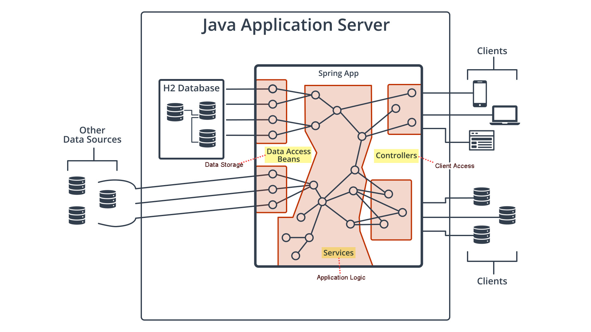

## Introduction to Spring Boot

- **Spring framework** is an umbrella project that encompasses many powerful Java libraries for **web development**. Spring includes 24 high-level industry standard solutions for **essential components of web development**, such as database access, security, cloud deployment, web services, and more.
- **Spring Boot** is a part of Spring framework. Spring Boot is a library meant for rapid application development and gives us many of spring's core libraries with minimal configuration.
- We have to learn **the Spring way of solving problems**.

#### Three main components 

3 main components in a standard web application:

- Data Storage: How the data is stored?
- Application Logic: What is the service of your application providing for users?
- Client Access: What type of client accesses to the service?

In **plain Java**, you have to do a lot of tasks to handle fully requirements of 3 above main components in a web application. With Spring, the solution to all of these is actually just **a Spring Boot application**. 

**How to build and manage each of 3 main components in Java using Spring Boot?**

- Write many **small Spring components** called **beans** or sometimes services, which are just Java classes that Spring **knows** about.
- These beans can take advantage of the Spring's vast array of libraries to perform tasks like database access or HTML template rendering.
- Spring allows us to create networks of **dependencies between beans**, which means we can write **single-purpose components** that rely on each other to perform complex tasks.

