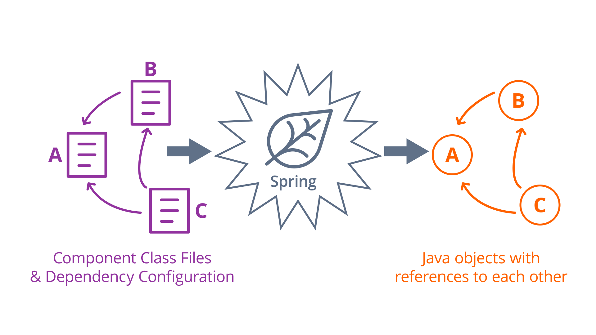
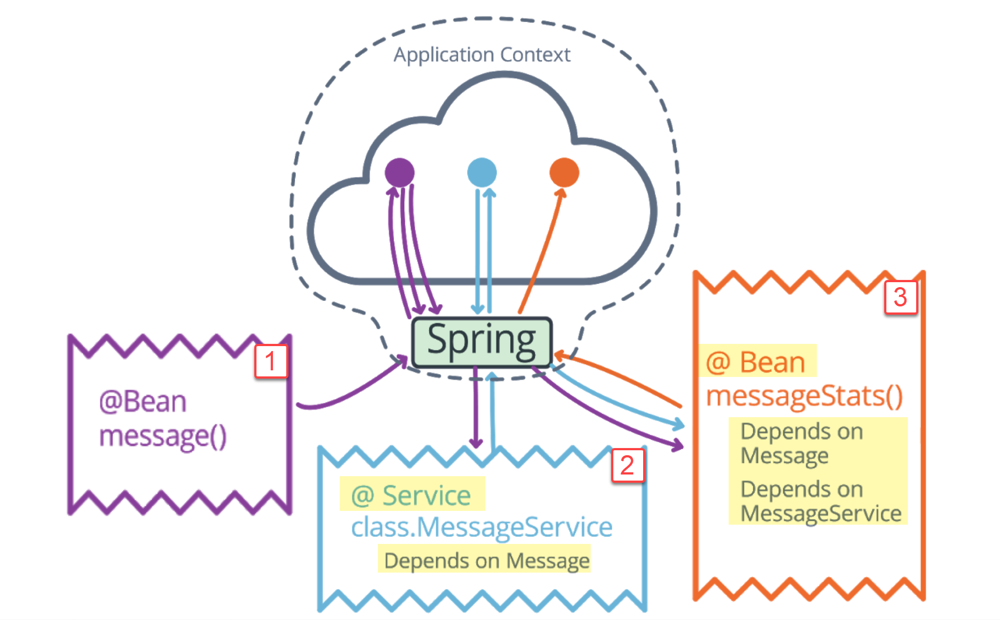
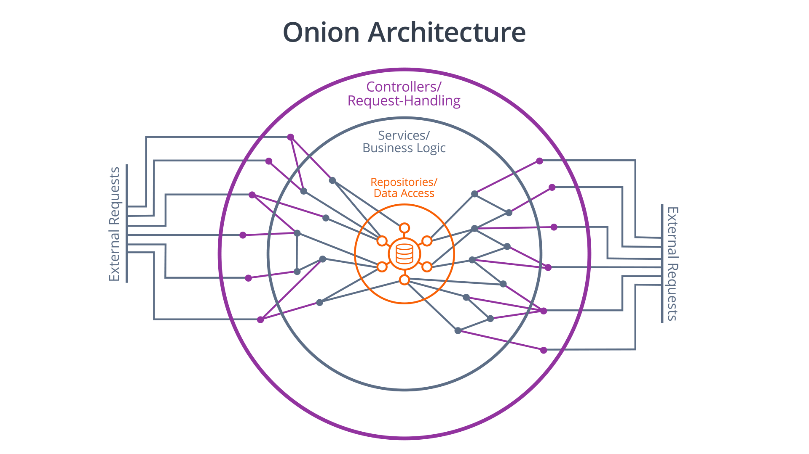

### Spring Boot Basics for Web Development

#### Inversion of Control (IoC)
Inversion of Control answers the question: _"How will I connect my application components with each other?"_

IoC is a software design pattern, where you tell a framework what components that your application needs, how to create them, and which components are needed by other components to function.

- Define application components and How to create them
- Define dependencies between components

Then, when you run the application, the IoC framework automatically initializes your components in a logical order and connects them according to their dependencies.

> Inversion of control is a common characteristic of frameworks, so saying that these lightweight containers are special because they use inversion of control is like saying my car is special because it has wheels. - Martin Fowler

Wait ... Is there some relationship between IoC with **Dependency Injection** (DI)? Read the following article of Martin Fowler to find out the answer. 
[Inversion of Control Containers and the Dependency Injection pattern - Martin Fowler](https://www.martinfowler.com/articles/injection.html)

#### What Spring Does?
Spring is an implementation of Inversion of Control (IoC), in particular Dependency Injection.

When we define a component, we also define its dependencies, other components that the component needs to perform its function.
Then, when we run our app, Spring ensures that all components are created in a compatible order, and **injects dependencies** in the components that declared them.

*The Spring Transformation*

_Dependencies_ can be everything from _string_, _numbers_ to _database drivers_ or _request handlers_.

Spring can recognize dependencies by **Java type**, **component name**, and **configuration property**, and how they **relate to each other.**

So, it's extremely flexible for us to define any number of possibly variable components, as dependencies to be injected throughout our app.


#### What game do you play with Spring?
**Separation of Concerns**

When developing a Spring application, the goal of a developer:
- is to **determine which components** are required.
- ensures that each component's purpose and a set of responsibilities are well defined. 

**2 primary types of java classes** you will need to implement in a spring application

- Data Types are simple classes to **store and represent complex data**. Data types are constructed on-demand to **satisfy certain features**. It means that we can create a new object to satisfy for our purpose. For example, we might create a new object of UserProfile when a client requests info about a specific user profile. But, we won't just have an instance hanging around.
- Components, on the other hand, are **persistent services** we can define for Spring to manage. Spring will instantiate these services, usually at the time of starting server and make them **available throughout** our application. In Spring, component classes are typically instantiated as **singletons**, meaning that only **one instance** of the class is created and managed by the Spring container.
- Do you understand the meaning of the word 'service'? Something like a library that provides methods related to a specific purpose.

#### Spring Boot IoC Configuration

**Remember:** Add annotations to classes and methods to **register** them as components and services within the Spring Application Context.

**What is an application context?**
Under the hood, Spring is just a Java application itself - and it responds to our configuration in a predictable way. 
When a Spring app starts, it scans your code based on specially-marked class files and configuration options to instantiate your app components as Java objects, and it stores them in **a special data structure** called **the application context**. 
The context is ultimately very similar to a **```map``` or ```set``` in Java or ```dictionary``` in Python**, and it can be queried at runtime to find specific components when needed.
This is a **closed system**. It means components instantiated **outside** of Spring will **not** automatically be injected with dependencies like those instantiated by Spring.

**Some Annotations in Spring**

**@SpringBootApplication**: put it on the main application class of a Spring Boot project. It is as an alias for:
- **@Configuration**: at **class** level. A class annotated with _@Configuration_ is instantiated and managed by Spring as a **component**, but also as a **bean factory**. Any methods of the configuration class that are annotated with _@Bean_ are used by Spring to create new beans to add to the application context.
- **@EnableAutoConfiguration**: at **class** level. It tells Spring to try to automatically match beans to dependencies based **primarily on type**.
- **@ComponentScan**: tells Spring to search in your code base for classes annotated with **_@Component_**. These classes will automatically be instantiated as Spring beans. Keep in mind that _@ComponentScan_ only enables Spring's component scanning in the same package or sub-packages of the _@SpringBootApplication_**'s location**.


*An example how Spring processes an IoC Configuration*

#### Key Terms
##### Onion Architecture
Onion Architecture: An **architectural pattern** in which an application is **separated into** nested layers. The separation of layers emphasizes clean **separation of concerns**.


*The basic structure of Onion Architecture*

- External requests must first pass through a layer of **controllers** or request handlers whose only purpose is to handle these external requests. 
- These controllers then use the next layer, **the services**, to process the actions or analysis triggered by the request.
- The services, in turn, use each other and the next layer, **repositories and data access**, to persist the results of the actions triggered by the request.

##### Application Component
In Spring, this is any _@Component_-annotated classes that is instantiated by Spring and placed in Spring's application context. Architecturally speaking, this is **a logical unit** of an application - a **single-purpose library or object** that solves a particular problem the application faces.

Annotations _@Controller_, _@Service_, _@Repository_ are all types of _@Component_ but more specific. 

- **_@Component_** is **the most generic type of bean**, and can be any kind of **shared application structure**.
- **_@Service_** is for services. A service is specifically a collection of **library** methods that manage one aspect of an application's business logic. Services represent the middle layer of an onion architecture, and should contain the bulk of an application's business logic. For example, a ```UserService``` would expose high-level actions related to the users of an app, and an ```AuthenticationService``` would expose actions for registering and authenticating a user.
- **_@Repository_** is for repositories. A repository should act like an **interface** to a **specific** set of stored data. Repositories represent the inner layer. For example, a ```UserRepository``` would expose an interface capable of ```create/read/update/delete``` and query operations on the ```users``` table of the database.

#### Server-Wide Configuration

Spring Boot is designed with **convention** over configuration, which means that every configuration option has a default behavior. So, the setting file ```application.properties``` starts off empty. 
[An example of ```application.properties```](../spring-boot/eg/application.properties)

[Common App Properties](https://docs.spring.io/spring-boot/docs/current/reference/html/application-properties.html)

#### @PostConstruct
- _@PostConstruct_ annotation tells Spring to call a bean method annotated with _@PostConstruct_ immediately **after** instantiating the bean and placing it in the application context.

```
@Service
public class MessageService {
  private String message;

  public MessageService(String msg){
    this.message = msg;
  }

  //other methods

  @PostConstruct
  public void postConstruct(){
    System.out.println("Service MessageService is created!");
  }
}
 ```
### Quizzes

1. What benefits of Spring help enable structured software development?
     - [x] Encourage development of single-purpose components that can be combined to implement business features.
     - [ ] Forcing developer to identify the order components should be instantiated.
     - [x] Injecting resources into whichever classes use them.
     - [x] Matching dependency requests to resources by Java type, component name, or a configuration property.
     - [x] Injecting values, strings, and numbers, but requiring complex objects to be created by the programmer.

