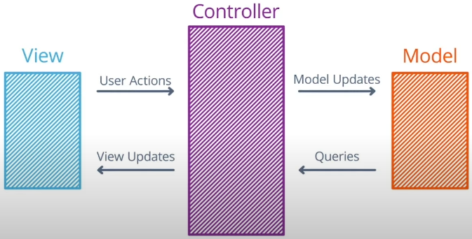
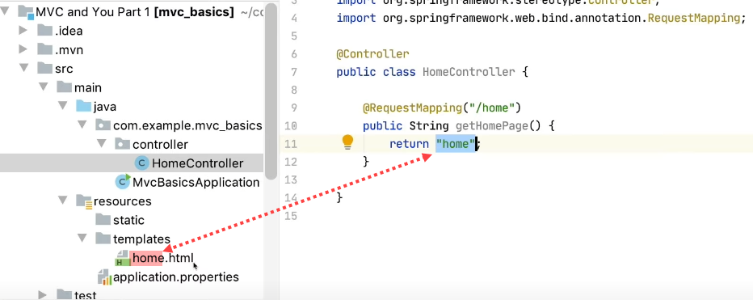
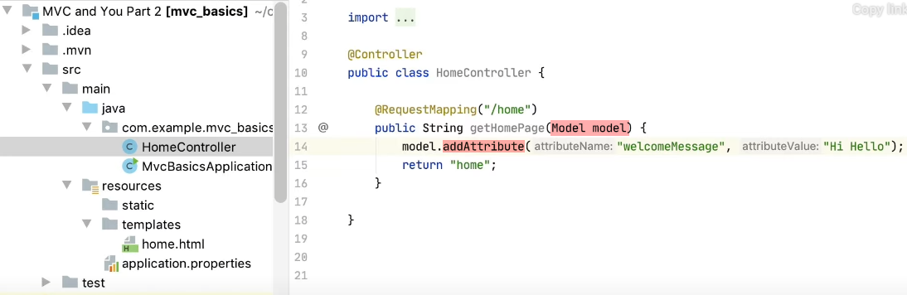
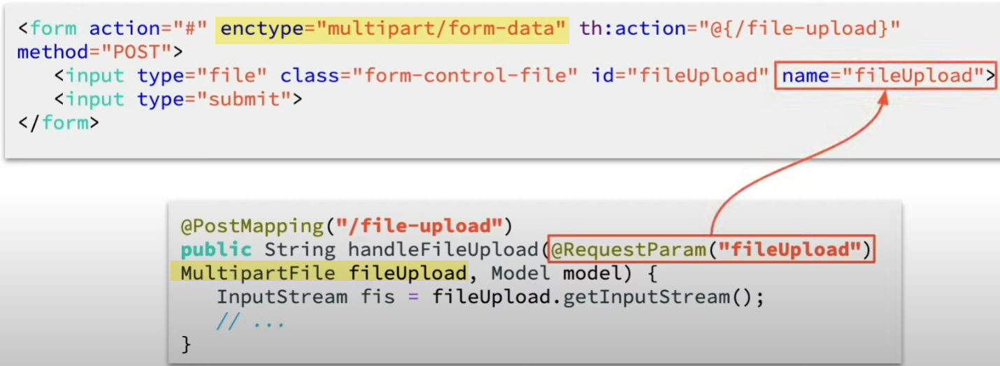

### Spring MVC and Thymeleaf

#### Traditional MVC Structure

_The MVC Abstraction Structure_

MVC stands for Model-View-Controller, which is a common software pattern for **user interface design**. Traditionally, it divides the roles of components in an app into **3 layers**:

- **Model**: maintain the **state** of an app
- **View**: display the UI to users
- **Controller**: process user actions sent from the _View_ to update the _Model_, and forward those updates back to the _View_

[Read more: High-level Overview of Different MVC Variants](https://uniandes-se4ma.gitlab.io/books/chapter8/mvc-mvvm-mv-mvwhat.html)

#### Spring MVC 

_Spring MVC Architecture_

Spring MVC is built around the browser as a platform, and it organizes 3 above roles as below:

- **HTTP templates** are the views - each one represents a screen component that the user is shown
- **Spring beans** are the controllers - Spring MVC gives an _@Controller_ annotation that we can use to **register** our beans as controllers. They are as specialized app components that can define methods to **handle specific user requests**. Those methods are responsible for choosing the **the HTTP template** that is generated in response, as well as for populating the ```Model``` object for that template.
- ```Model``` objects are the models - they are as simple data-transfer objects that can store various **bits of data** in the _key-value_ form. Each controller can take an **optional ```Model``` argument**.

**Basic Flow in Spring MVC**

_Indicate which template chosen to render_


_How to use Model object as transfer-data object in Spring MVC_

#### Thymeleaf

Thymeleaf is the HTML _template engine_, which means that it's a **library** that can take a template, a data model, and combine them to generate a final HTML document.

[The official Thymeleaf tutorial](https://www.thymeleaf.org/doc/tutorials/3.0/usingthymeleaf.html)
[Thymeleaf expression syntax](https://www.thymeleaf.org/doc/tutorials/3.0/usingthymeleaf.html#standard-expression-syntax)

#### Form-Backing Object

**Form-Backing Object:** This is a term used by Spring MVC and Thymeleaf to mean **an object** that represents the data contained in a form. 

- On the Thymeleaf side, this is referred to in the ```th:object``` attribute on the form.

```
<form th:object="${newMessage}" th:action="@{/home}" action="#" method="POST">
    <input th:field="*{text}" type="text">
    <input type="submit">
</form>
```

- On the Spring side, this is usually **an additional argument** to the relevant Controller method

```
@GetMapping("/home")
public String getHomePage(@ModelAttribute("newMessage") MessageForm newMessage, Model model) {
    model.addAttribute("greetings", this.messageListService.getMessages());
    return "home";
}

@PostMapping("/home")
public String addMessage(@ModelAttribute("newMessage") MessageForm messageForm, Model model) {
    messageListService.addMessage(messageForm.getText());
    model.addAttribute("greetings", messageListService.getMessages());
    messageForm.setText("");
    return "home";
}
```

- **_@ModelAttribute_**: identify objects that contain **form data**

#### MultiPartFile Upload


_File Upload_

[Official Spring MVC file upload tutorial](https://spring.io/guides/gs/uploading-files/)
