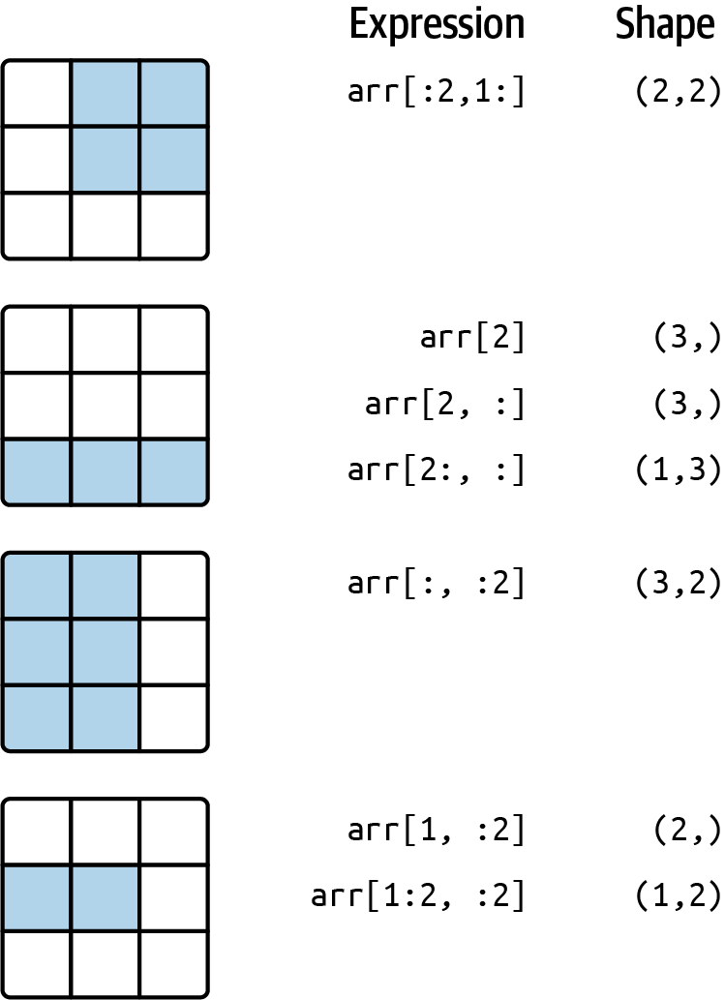

### NumPy 

#### Some terms

- **Data munging and cleaning**
- **Data subsetting and filtering**
- **Data transformation**: convert and restructure data from one format or structure into another

#### Why NumPy?

**1. Memory**
- Internally, it stores data in **a contiguous block of memory**, independent of other built-in Python objects.
- Lib of algorithms written in C can operate on this memory without any type checking or other overhead

**2. Without *for loops***
- Perform computations on **entire arrays** without the need of *for* loops

#### ndarray

- a container for **homo**geneous data
- important attributes:

  - *shape*
  - *dtype*

**Note:** 
1. *dtype* is an attribute of NumPy. While variables in Python are dynamically typed, meaning the interpreter determines the type during runtime, in NumPy or Pandas libraries *dtype* is an important attribute for optimizing memory usage and numerical operations.

##### Indexing with slices

Source: [Python for data Analysis](https://wesmckinney.com/book/numpy-basics)